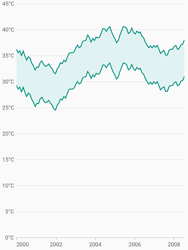

# Range area Chart in Flutter Cartesian Charts (SfCartesianChart)

To create a Flutter range area chart quickly, you can check this video.

<iframe id='flutterRangeareaChartTutorial' src='https://www.youtube.com/embed/uSsKhlRzC2Q'></iframe>

To render a range area chart, create an instance of `RangeAreaSeries` and add to the [`series`](https://pub.dev/documentation/syncfusion_flutter_charts/latest/charts/SfCartesianChart/series.html) collection property of [`SfCartesianChart`](https://pub.dev/documentation/syncfusion_flutter_charts/latest/charts/SfCartesianChart-class.html). 

Since the [`RangeAreaSeries`](https://pub.dev/documentation/syncfusion_flutter_charts/latest/charts/RangeAreaSeries-class.html) requires two Y values for a point, your data should contain high and low values. High and low value specifies the maximum and minimum range of the point. 

* [`highValueMapper`](https://pub.dev/documentation/syncfusion_flutter_charts/latest/charts/CartesianSeries/highValueMapper.html) - field in the data source, which is considered as high value for the data points.
* [`lowValueMapper`](https://pub.dev/documentation/syncfusion_flutter_charts/latest/charts/CartesianSeries/lowValueMapper.html) - field in the data source, which is considered as low value for the data points. 

 
    
    @override
    Widget build(BuildContext context) {
         return Scaffold(
            body: Center(
                child: Container(
                    child: SfCartesianChart(
                        primaryXAxis: DateTimeAxis(),
                        series: <ChartSeries>[
                            RangeAreaSeries<ChartData, DateTime>(
                                dataSource: chartData,
                                xValueMapper: (ChartData sales, _) => sales.x,
                                lowValueMapper: (ChartData sales, _) => sales.low,
                                highValueMapper: (ChartData sales, _) => sales.high,
                            )
                        ]
                    )
                )   
            )
        );
    }

    class ChartData {
        ChartData(this.x, this.high, this.low);
            final DateTime x;
            final double high;
            final double low;
    }



###	Border customization

The borders of the range area chart can be customized using the [`borderDrawMode`](https://pub.dev/documentation/syncfusion_flutter_charts/latest/charts/RangeAreaSeries/borderDrawMode.html) property. The default value of the [`RangeAreaBorderMode`](https://pub.dev/documentation/syncfusion_flutter_charts/latest/charts/RangeAreaBorderMode-class.html) property is `all` and the other value is `excludeSides`.

 

    @override
    Widget build(BuildContext context) {
        return Scaffold(
            body: Center(
                child: Container(
                    child: SfCartesianChart(
                        primaryXAxis: DateTimeAxis(),
                        series: <ChartSeries>[
                            RangeAreaSeries<SalesData, DateTime>(
                                dataSource: chartData,
                                color: Color.fromRGB(224, 242, 241,1),
                                borderDrawMode: RangeAreaBorderMode.excludeSides,
                                borderColor: Colors.green,
                                borderWidth: 2,
                                xValueMapper: (SalesData sales, _) => sales.year,
                                yValueMapper: (SalesData sales, _) => sales.sales
                            )
                        ]
                    )
                )
            )
        );
    }



