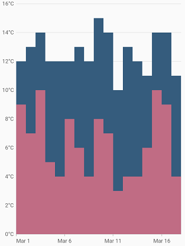
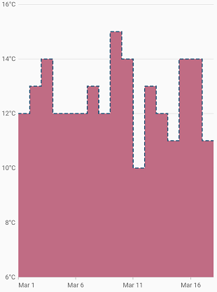

# Step area Chart in Flutter Cartesian Charts (SfCartesianChart)

To render a spline area chart, create an instance of `StepAreaSeries`, and add it to the [`series`](https://pub.dev/documentation/syncfusion_flutter_charts/latest/charts/SfCartesianChart/series.html) collection property of [`SfCartesianChart`](https://pub.dev/documentation/syncfusion_flutter_charts/latest/charts/SfCartesianChart/SfCartesianChart.html). The following properties can be used to customize the appearance of spline area chart.

* [`color`](https://pub.dev/documentation/syncfusion_flutter_charts/latest/charts/CartesianSeries/color.html) - changes the color of the series.
* [`opacity`](https://pub.dev/documentation/syncfusion_flutter_charts/latest/charts/CartesianSeries/opacity.html) - controls the transparency of the chart series.
* [`width`](https://pub.dev/documentation/syncfusion_flutter_charts/latest/charts/CartesianSeries/width.html) - changes the stroke width of the series.

 

    @override
    Widget build(BuildContext context) {
        return Scaffold(
            body: Center(
                child: Container(
                    child: SfCartesianChart(
                        primaryXAxis: DateTimeAxis(),
                        series: <ChartSeries>[
                            StepAreaSeries<SalesData, DateTime>(
                                dataSource: chartData,
                                xValueMapper: (SalesData sales, _) => sales.year,
                                yValueMapper: (SalesData sales, _) => sales.sales
                            ),
                            StepAreaSeries<SalesData, DateTime>(
                                dataSource: chartData1,
                                xValueMapper: (SalesData sales, _) => sales.year,
                                yValueMapper: (SalesData sales, _) => sales.sales
                            )
                        ]
                    )
                )
            )
        );
    }



## Dashed step area

The [`dashArray`](https://pub.dev/documentation/syncfusion_flutter_charts/latest/charts/CartesianSeries/dashArray.html) property of the [`StepAreaSeries`](https://pub.dev/documentation/syncfusion_flutter_charts/latest/charts/StepAreaSeries-class.html) is used to render spline area series with dashes. Odd value is considered as rendering size and even value is considered as gap.

 
    
    @override
    Widget build(BuildContext context) {
        return Scaffold(
            body: Center(
                child: Container(
                    child: SfCartesianChart(
                        primaryXAxis: DateTimeAxis(),
                        series: <ChartSeries>[
                            StepAreaSeries<SalesData, DateTime>(
                                dataSource: chartData,
                                dashArray: <double>[5, 5],
                                xValueMapper: (SalesData sales, _) => sales.year,
                                yValueMapper: (SalesData sales, _) => sales.sales
                            )
                        ]
                    )
                )
            )
        );
    }



