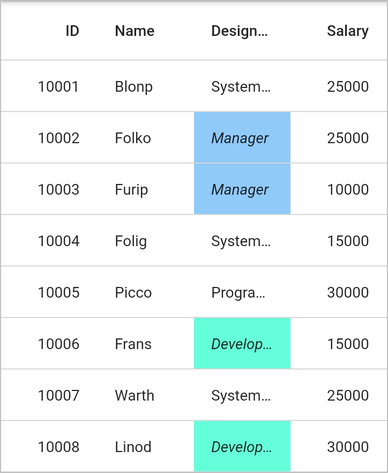
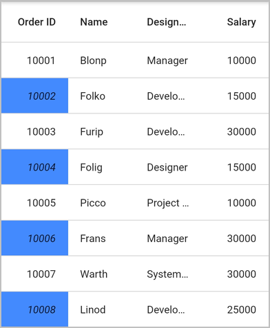
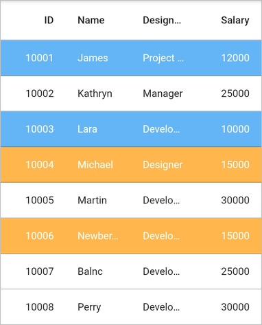
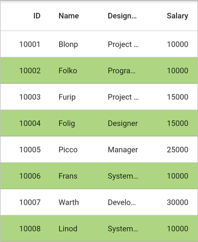

# Conditional Styling in Flutter DataGrid (SfDataGrid)

The [SfDataGrid](https://pub.dev/documentation/syncfusion_flutter_datagrid/latest/datagrid/SfDataGrid-class.html) allows to customize the style of the individual cells and rows based on the requirements. You can customize your widget in the `DataGridSource.buildRow` method with the help of `DataGridRowAdapter`.

## Cells

### Styling based on content

The appearance of the cells in `SfDataGrid` can be customized conditionally based on the content and set your widget to the `DataGridRowAdapter.cells`.


 

import 'package:syncfusion_flutter_datagrid/datagrid.dart';

@override
Widget build(BuildContext context) {
  return Scaffold(
    body: SfDataGrid(
      source: _employeeDataSource,
      columnWidthMode: ColumnWidthMode.lastColumnFill,
      columns: <GridColumn>[
        GridColumn(
          columnName: 'id',
          label: Container(
            padding: EdgeInsets.symmetric(horizontal: 16.0),
            alignment: Alignment.centerRight,
            child: Text(
              'ID',
              overflow: TextOverflow.ellipsis,
            ),
          ),
        ),
        GridColumn(
          columnName: 'name',
          label: Container(
            padding: EdgeInsets.symmetric(horizontal: 16.0),
            alignment: Alignment.centerLeft,
            child: Text(
              'Name',
              overflow: TextOverflow.ellipsis,
            ),
          ),
        ),
        GridColumn(
          columnName: 'designation',
          label: Container(
            padding: EdgeInsets.symmetric(horizontal: 16.0),
            alignment: Alignment.centerLeft,
            child: Text(
              'Designation',
              overflow: TextOverflow.ellipsis,
            ),
          ),
        ),
        GridColumn(
          columnName: 'salary',
          label: Container(
            padding: EdgeInsets.symmetric(horizontal: 16.0),
            alignment: Alignment.centerRight,
            child: Text(
              'Salary',
              overflow: TextOverflow.ellipsis,
            ),
          ),
        ),
      ],
    ),
  );
}

class EmployeeDataSource extends DataGridSource {
  EmployeeDataSource(List<Employee> employees) {
    dataGridRows = employees
        .map<DataGridRow>((dataGridRow) => DataGridRow(cells: [
              DataGridCell<int>(columnName: 'id', value: dataGridRow.id),
              DataGridCell<String>(columnName: 'name', value: dataGridRow.name),
              DataGridCell<String>(
                  columnName: 'designation', value: dataGridRow.designation),
              DataGridCell<int>(
                  columnName: 'salary', value: dataGridRow.salary),
            ]))
        .toList();
  }

  List<DataGridRow> dataGridRows = [];

  @override
  List<DataGridRow> get rows => dataGridRows;

  @override
  DataGridRowAdapter? buildRow(DataGridRow row) {
    return DataGridRowAdapter(
        cells: row.getCells().map<Widget>((dataGridCell) {
      Color getColor() {
        if (dataGridCell.columnName == 'designation') {
          if (dataGridCell.value == 'Developer') {
            return Colors.tealAccent;
          } else if (dataGridCell.value == 'Manager') {
            return Colors.blue[200]!;
          }
        }

        return Colors.transparent;
      }

      TextStyle? getTextStyle() {
        if (dataGridCell.columnName == 'designation') {
          if (dataGridCell.value == 'Developer') {
            return TextStyle(fontStyle: FontStyle.italic);
          } else if (dataGridCell.value == 'Manager') {
            return TextStyle(fontStyle: FontStyle.italic);
          }
        }

        return null;
      }

      return Container(
          color: getColor(),
          alignment: (dataGridCell.columnName == 'id' ||
                  dataGridCell.columnName == 'salary')
              ? Alignment.centerRight
              : Alignment.centerLeft,
          padding: EdgeInsets.symmetric(horizontal: 16.0),
          child: Text(
            dataGridCell.value.toString(),
            overflow: TextOverflow.ellipsis,
            style: getTextStyle(),
          ));
    }).toList());
  }
}




### Styling alternate cells

The appearance of the alternating cells in a column can be customized conditionally by using the `DataGridSource.buildRow` method.


 

class EmployeeDataSource extends DataGridSource {
  EmployeeDataSource(List<Employee> employees) {
    dataGridRows = employees
        .map<DataGridRow>((dataGridRow) => DataGridRow(cells: [
              DataGridCell<int>(columnName: 'id', value: dataGridRow.id),
              DataGridCell<String>(columnName: 'name', value: dataGridRow.name),
              DataGridCell<String>(
                  columnName: 'designation', value: dataGridRow.designation),
              DataGridCell<int>(
                  columnName: 'salary', value: dataGridRow.salary),
            ]))
        .toList();
  }

  List<DataGridRow> dataGridRows = [];

  @override
  List<DataGridRow> get rows => dataGridRows;

  @override
  DataGridRowAdapter? buildRow(DataGridRow row) {
    return DataGridRowAdapter(
        cells: row.getCells().map<Widget>((dataGridCell) {
      if (dataGridCell.columnName == 'id') {
        final int index = dataGridRows.indexOf(row);
        return Container(
            color: (index % 2 != 0) ? Colors.blueAccent : Colors.transparent,
            alignment: Alignment.centerRight,
            padding: EdgeInsets.symmetric(horizontal: 16.0),
            child: Text(
              dataGridCell.value.toString(),
              overflow: TextOverflow.ellipsis,
              style: (index % 2 != 0)
                  ? TextStyle(fontStyle: FontStyle.italic)
                  : null,
            ));
      }
      return Container(
          alignment: (dataGridCell.columnName == 'salary')
              ? Alignment.centerRight
              : Alignment.centerLeft,
          padding: EdgeInsets.symmetric(horizontal: 16.0),
          child: Text(
            dataGridCell.value.toString(),
            overflow: TextOverflow.ellipsis,
          ));
    }).toList());
  }
}




## Rows

### Styling based on content

The appearance of the rows in `SfDataGrid` can be customized conditionally based on the content in `DataGridRowAdapter.color`.


 

import 'package:syncfusion_flutter_datagrid/datagrid.dart';
      
class EmployeeDataSource extends DataGridSource {
  EmployeeDataSource(List<Employee> employees) {
    dataGridRows = employees
        .map<DataGridRow>((dataGridRow) => DataGridRow(cells: [
              DataGridCell<int>(columnName: 'id', value: dataGridRow.id),
              DataGridCell<String>(columnName: 'name', value: dataGridRow.name),
              DataGridCell<String>(
                  columnName: 'designation', value: dataGridRow.designation),
              DataGridCell<int>(
                  columnName: 'salary', value: dataGridRow.salary),
            ]))
        .toList();
  }

  List<DataGridRow> dataGridRows = [];

  @override
  List<DataGridRow> get rows => dataGridRows;

  @override
  DataGridRowAdapter buildRow(DataGridRow row) {
    Color getRowBackgroundColor() {
      final int salary = row.getCells()[3].value;
      if (salary >= 10000 && salary < 15000) {
        return Colors.blue[300]!;
      } else if (salary <= 15000) {
        return Colors.orange[300]!;
      }

      return Colors.transparent;
    }

    TextStyle? getTextStyle() {
      final int salary = row.getCells()[3].value;
      if (salary >= 10000 && salary < 15000) {
        return TextStyle(color: Colors.white);
      } else if (salary <= 15000) {
        return TextStyle(color: Colors.white);
      }

      return null;
    }

    return DataGridRowAdapter(
        color: getRowBackgroundColor(),
        cells: row.getCells().map<Widget>((dataGridCell) {
          return Container(
              alignment: (dataGridCell.columnName == 'id' ||
                      dataGridCell.columnName == 'salary')
                  ? Alignment.centerRight
                  : Alignment.centerLeft,
              padding: EdgeInsets.symmetric(horizontal: 16.0),
              child: Text(
                dataGridCell.value.toString(),
                overflow: TextOverflow.ellipsis,
                style: getTextStyle(),
              ));
        }).toList());
  }
}




### Styling alternate rows

The appearance of the alternating rows in `SfDataGrid` can be customized by using the `DataGridRowAdapter.color`.


 

import 'package:syncfusion_flutter_datagrid/datagrid.dart';

class EmployeeDataSource extends DataGridSource {
  EmployeeDataSource(List<Employee> employees) {
    dataGridRows = employees
        .map<DataGridRow>((dataGridRow) => DataGridRow(cells: [
              DataGridCell<int>(columnName: 'id', value: dataGridRow.id),
              DataGridCell<String>(columnName: 'name', value: dataGridRow.name),
              DataGridCell<String>(
                  columnName: 'designation', value: dataGridRow.designation),
              DataGridCell<int>(
                  columnName: 'salary', value: dataGridRow.salary),
            ]))
        .toList();
  }

  List<DataGridRow> dataGridRows = [];

  @override
  List<DataGridRow> get rows => dataGridRows;

  @override
  DataGridRowAdapter? buildRow(DataGridRow row) {
    Color getRowBackgroundColor() {
      final int index = dataGridRows.indexOf(row);
      if (index % 2 != 0) {
        return Colors.lightGreen[300]!;
      }

      return Colors.transparent;
    }

    return DataGridRowAdapter(
        color: getRowBackgroundColor(),
        cells: row.getCells().map<Widget>((dataGridCell) {
          return Container(
              alignment: (dataGridCell.columnName == 'id' ||
                      dataGridCell.columnName == 'salary')
                  ? Alignment.centerRight
                  : Alignment.centerLeft,
              padding: EdgeInsets.symmetric(horizontal: 16.0),
              child: Text(
                dataGridCell.value.toString(),
                overflow: TextOverflow.ellipsis,
              ));
        }).toList());
  }
}




