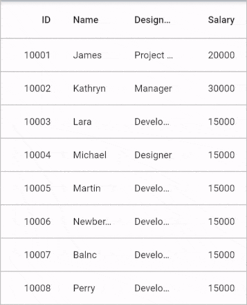
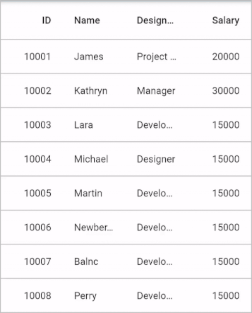
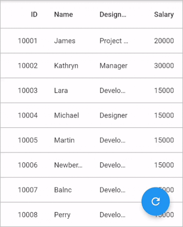

# Pull to Refresh in Flutter DataGrid (SfDataGrid)

The Flutter DataTable provides support to add more data at runtime by using the PullToRefresh feature.
You can simply enable the PullToRefresh option by setting the [SfDataGrid.allowPullToRefresh](https://pub.dev/documentation/syncfusion_flutter_datagrid/latest/datagrid/SfDataGrid/allowPullToRefresh.html) property to `true` and override the [DataGridSource.handleRefresh](https://pub.dev/documentation/syncfusion_flutter_datagrid/latest/datagrid/DataGridSource/handleRefresh.html) method to include the data which is going to add to the data source at runtime and then notify the data grid about the changes.


 

import 'package:syncfusion_flutter_datagrid/datagrid.dart';

EmployeeDataSource _employeeDataSource = EmployeeDataSource();

@override
Widget build(BuildContext context) {
  return SfDataGrid(
    allowPullToRefresh: true,
    source: _employeeDataSource,
    columns: <GridColumn>[
      GridColumn(
          columnName: 'id',
          label: Container(
              padding: EdgeInsets.symmetric(horizontal: 16.0),
              alignment: Alignment.centerRight,
              child: Text(
                'ID',
                overflow: TextOverflow.ellipsis,
              ))),
      GridColumn(
          columnName: 'name',
          label: Container(
              padding: EdgeInsets.symmetric(horizontal: 16.0),
              alignment: Alignment.centerLeft,
              child: Text(
                'Name',
                overflow: TextOverflow.ellipsis,
              ))),
      GridColumn(
          columnName: 'designation',
          label: Container(
              padding: EdgeInsets.symmetric(horizontal: 16.0),
              alignment: Alignment.centerLeft,
              child: Text(
                'Designation',
                overflow: TextOverflow.ellipsis,
              ))),
      GridColumn(
          columnName: 'salary',
          label: Container(
              padding: EdgeInsets.symmetric(horizontal: 16.0),
              alignment: Alignment.centerRight,
              child: Text(
                'Salary',
                overflow: TextOverflow.ellipsis,
              ))),
    ],
  );
}

class EmployeeDataSource extends DataGridSource {
  EmployeeDataSource() {
    buildDataGridRows();
  }

  List<DataGridRow> dataGridRows = [];

  @override
  List<DataGridRow> get rows => dataGridRows;

  @override
  DataGridRowAdapter? buildRow(DataGridRow row) {
    return DataGridRowAdapter(
        cells: row.getCells().map<Widget>((dataGridCell) {
      return Container(
          alignment: (dataGridCell.columnName == 'id' ||
                  dataGridCell.columnName == 'salary')
              ? Alignment.centerRight
              : Alignment.centerLeft,
          padding: EdgeInsets.symmetric(horizontal: 16.0),
          child: Text(
            dataGridCell.value.toString(),
            overflow: TextOverflow.ellipsis,
          ));
    }).toList());
  }

  @override
  Future<void> handleRefresh() async {
    await Future.delayed(Duration(seconds: 5));
    _addMoreRows(_employees, 15);
    buildDataGridRows();
    notifyListeners();
  }

  void buildDataGridRows() {
    dataGridRows = _employees
        .map<DataGridRow>((dataGridRow) => DataGridRow(cells: [
              DataGridCell<int>(columnName: 'id', value: dataGridRow.id),
              DataGridCell<String>(columnName: 'name', value: dataGridRow.name),
              DataGridCell<String>(
                  columnName: 'designation', value: dataGridRow.designation),
              DataGridCell<int>(
                  columnName: 'salary', value: dataGridRow.salary),
            ]))
        .toList();
  }

  void _addMoreRows(List<Employee> employees, int count) {
    final Random _random = Random();
    final startIndex = employees.isNotEmpty ? employees.length : 0,
        endIndex = startIndex + count;
    for (int i = startIndex; i < endIndex; i++) {
      employees.add(Employee(
        1000 + i,
        _names[_random.nextInt(_names.length - 1)],
        _designation[_random.nextInt(_designation.length - 1)],
        10000 + _random.nextInt(10000),
      ));
    }
  }

  final List<String> _names = <String>[
    'Welli',
    'Blonp',
    'Folko',
    'Furip',
    'Folig',
    'Picco',
    'Frans',
    'Warth',
    'Linod',
    'Simop',
    'Merep',
    'Riscu',
    'Seves',
    'Vaffe',
    'Alfki'
  ];

  final List<String> _designation = <String>[
    'Project Lead',
    'Developer',
    'Manager',
    'Designer',
    'System Analyst',
    'CEO'
  ];
}




## Customizing the refresh indicator

SfDataGrid displays the [RefreshIndicator](https://api.flutter.dev/flutter/material/RefreshIndicator-class.html) for `pull to refresh` action. So, you can set the color and background color of refresh indicator by using [ThemeData.accentColor](https://api.flutter.dev/flutter/material/ThemeData/accentColor.html) and  [ThemeData.canvasColor](https://api.flutter.dev/flutter/material/ThemeData/canvasColor.html) properties.

You can also change the stroke width and displacement of refresh indicator by using [SfDataGrid.refreshIndicatorStrokeWidth](https://pub.dev/documentation/syncfusion_flutter_datagrid/latest/datagrid/SfDataGrid/refreshIndicatorStrokeWidth.html) and [SfDataGrid.refreshIndicatorDisplacement](https://pub.dev/documentation/syncfusion_flutter_datagrid/latest/datagrid/SfDataGrid/refreshIndicatorDisplacement.html) properties.


 

import 'package:syncfusion_flutter_datagrid/datagrid.dart';

EmployeeDataSource _employeeDataSource = EmployeeDataSource();

@override
Widget build(BuildContext context) {
  return Theme(
      data: ThemeData(
        accentColor: Colors.white,
        canvasColor: Colors.lightBlue,
      ),
      child: SfDataGrid(
          allowPullToRefresh: true,
          source: _employeeDataSource,
          refreshIndicatorStrokeWidth: 3.0,
          refreshIndicatorDisplacement: 60.0,
          columns: <GridColumn>[
            GridColumn(
                columnName: 'id',
                label: Container(
                    padding: EdgeInsets.symmetric(horizontal: 16.0),
                    alignment: Alignment.centerRight,
                    child: Text(
                      'ID',
                      overflow: TextOverflow.ellipsis,
                    ))),
            GridColumn(
                columnName: 'name',
                label: Container(
                    padding: EdgeInsets.symmetric(horizontal: 16.0),
                    alignment: Alignment.centerLeft,
                    child: Text(
                      'Name',
                      overflow: TextOverflow.ellipsis,
                    ))),
            GridColumn(
                columnName: 'designation',
                label: Container(
                    padding: EdgeInsets.symmetric(horizontal: 16.0),
                    alignment: Alignment.centerLeft,
                    child: Text(
                      'Designation',
                      overflow: TextOverflow.ellipsis,
                    ))),
            GridColumn(
                columnName: 'salary',
                label: Container(
                    padding: EdgeInsets.symmetric(horizontal: 16.0),
                    alignment: Alignment.centerRight,
                    child: Text(
                      'Salary',
                      overflow: TextOverflow.ellipsis,
                    ))),
          ]));
}




## Programmatic Pull to Refresh

If you want to refresh data without showing a refresh indicator, you can pass `false` to the `showRefreshIndicator` optional parameter of [refresh](https://pub.dev/documentation/syncfusion_flutter_datagrid/latest/datagrid/SfDataGridState/refresh.html) method. By doing this, `DataGridSource.handleRefresh` method will be called without showing the `RefreshIndicator` in UI.


 

import 'package:syncfusion_flutter_datagrid/datagrid.dart';

final GlobalKey<SfDataGridState> key = GlobalKey<SfDataGridState>();
EmployeeDataSource _employeeDataSource = EmployeeDataSource();

@override
Widget build(BuildContext context) {
  return Scaffold(
      body: SfDataGrid(
        key: key,
        allowPullToRefresh: true,
        source: _employeeDataSource,
        columns: <GridColumn>[
          GridColumn(
              columnName: 'id',
              label: Container(
                  padding: EdgeInsets.symmetric(horizontal: 16.0),
                  alignment: Alignment.centerRight,
                  child: Text(
                    'ID',
                    overflow: TextOverflow.ellipsis,
                  ))),
          GridColumn(
              columnName: 'name',
              label: Container(
                  padding: EdgeInsets.symmetric(horizontal: 16.0),
                  alignment: Alignment.centerLeft,
                  child: Text(
                    'Name',
                    overflow: TextOverflow.ellipsis,
                  ))),
          GridColumn(
              columnName: 'designation',
              label: Container(
                  padding: EdgeInsets.symmetric(horizontal: 16.0),
                  alignment: Alignment.centerLeft,
                  child: Text(
                    'Designation',
                    overflow: TextOverflow.ellipsis,
                  ))),
          GridColumn(
              columnName: 'salary',
              label: Container(
                  padding: EdgeInsets.symmetric(horizontal: 16.0),
                  alignment: Alignment.centerRight,
                  child: Text(
                    'Salary',
                    overflow: TextOverflow.ellipsis,
                  ))),
        ],
      ),
      floatingActionButton: FloatingActionButton(
          child: Icon(Icons.refresh),
          onPressed: () {
            key.currentState!.refresh();
          }));
}




