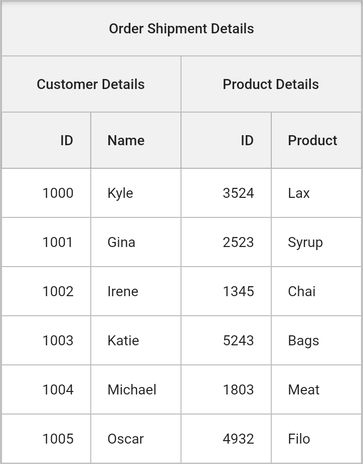

# Stacked headers in Flutter Datagrid

The datagrid provides support to display an additional unbound header rows known as [StackedHeaderRows](https://pub.dev/documentation/syncfusion_flutter_datagrid/latest/datagrid/SfDataGrid/stackedHeaderRows.html) that are spanned across the DataGrid columns. You can group one or more columns under each stacked header.

Each [StackedHeaderRow](https://pub.dev/documentation/syncfusion_flutter_datagrid/latest/datagrid/StackedHeaderRow-class.html) contains [cells](https://pub.dev/documentation/syncfusion_flutter_datagrid/latest/datagrid/StackedHeaderRow/cells.html) that hold a list of [StackedHeaderCell](https://pub.dev/documentation/syncfusion_flutter_datagrid/latest/datagrid/StackedHeaderCell-class.html) where each `StackedHeaderCell` contains a number of child columns. The [StackedHeaderCell.columnNames](https://pub.dev/documentation/syncfusion_flutter_datagrid/latest/datagrid/StackedHeaderCell/columnNames.html) property returns the columns grouped under the stacked header row. The [GridColumn.columnName]() is a unique name used for mapping specific child columns grouped under the same stacked header row. The [StackedHeaderCell.child](https://pub.dev/documentation/syncfusion_flutter_datagrid/latest/datagrid/StackedHeaderCell/child.html) property is used to load any type of widget to the corresponding stacked header cell.


 

import 'package:syncfusion_flutter_core/theme.dart';
import 'package:syncfusion_flutter_datagrid/datagrid.dart';

@override
Widget build(BuildContext context) {
  return SfDataGrid(
    gridLinesVisibility: GridLinesVisibility.both,
    headerGridLinesVisibility: GridLinesVisibility.both,
    source: _productDataSource,
    columns: <GridColumn>[
      GridTextColumn(
        columnName: 'orderId',
        label: Container(
          padding: EdgeInsets.symmetric(horizontal: 16.0),
          alignment: Alignment.centerRight,
          child: Text(
            'ID',
            overflow: TextOverflow.ellipsis,
          ))),
      GridTextColumn(
        columnName: 'customerName',
        label: Container(
          padding: EdgeInsets.symmetric(horizontal: 16.0),
          alignment: Alignment.centerLeft,
          child: Text(
            'Name',
            overflow: TextOverflow.ellipsis,
          ))),
      GridTextColumn(
        columnName: 'productId',
        label: Container(
          padding: EdgeInsets.symmetric(horizontal: 16.0),
          alignment: Alignment.centerRight,
          child: Text(
            'ID',
            overflow: TextOverflow.ellipsis,
          ))),
      GridTextColumn(
        columnName: 'product',
        label: Container(
          padding: EdgeInsets.symmetric(horizontal: 16.0),
          alignment: Alignment.centerLeft,
          child: Text(
            'Product',
            overflow: TextOverflow.ellipsis,
          ))),
    ],
    stackedHeaderRows: <StackedHeaderRow>[
      StackedHeaderRow(cells: [
        StackedHeaderCell(
            columnNames: ['orderId', 'customerName'],
            child: Container(
                color: const Color(0xFFF1F1F1),
                child: Center(child: Text('Customer Details')))),
        StackedHeaderCell(
            columnNames: ['productId', 'product'],
            child: Container(
                color: const Color(0xFFF1F1F1),
                child: Center(child: Text('Product Details'))))
      ])
    ],
  );
}




## Multi stacked headers

You can provide multiple stacked headers to the datagrid by adding the multiple `StackedHeaderRow` to the `SfDataGrid.stackedHeaderRows` collection.


 

import 'package:syncfusion_flutter_core/theme.dart';
import 'package:syncfusion_flutter_datagrid/datagrid.dart';

@override
Widget build(BuildContext context) {
  return SfDataGrid(
    gridLinesVisibility: GridLinesVisibility.both,
    headerGridLinesVisibility: GridLinesVisibility.both,
    source: _productDataSource,
    columns: <GridColumn>[
      GridTextColumn(
        columnName: 'orderId',
        label: Container(
          padding: EdgeInsets.symmetric(horizontal: 16.0),
          alignment: Alignment.centerRight,
          child: Text(
            'ID',
            overflow: TextOverflow.ellipsis,
          ))),
      GridTextColumn(
        columnName: 'customerName',
        label: Container(
          padding: EdgeInsets.symmetric(horizontal: 16.0),
          alignment: Alignment.centerLeft,
          child: Text(
            'Name',
            overflow: TextOverflow.ellipsis,
          ))),
      GridTextColumn(
        columnName: 'productId',
        label: Container(
          padding: EdgeInsets.symmetric(horizontal: 16.0),
          alignment: Alignment.centerRight,
          child: Text(
            'ID',
            overflow: TextOverflow.ellipsis,
          ))),
      GridTextColumn(
        columnName: 'product',
        label: Container(
          padding: EdgeInsets.symmetric(horizontal: 16.0),
          alignment: Alignment.centerLeft,
          child: Text(
            'Product',
            overflow: TextOverflow.ellipsis,
          ))),
    ],
    stackedHeaderRows: <StackedHeaderRow>[
      StackedHeaderRow(cells: [
        StackedHeaderCell(
            columnNames: ['orderId', 'customerName', 'productId', 'product'],
            child: Container(
                color: const Color(0xFFF1F1F1),
                child: Center(child: Text('Order Shipment Details')))),
      ]),
      StackedHeaderRow(cells: [
        StackedHeaderCell(
            columnNames: ['orderId', 'customerName'],
            child: Container(
                color: const Color(0xFFF1F1F1),
                child: Center(child: Text('Customer Details')))),
        StackedHeaderCell(
            columnNames: ['productId', 'product'],
            child: Container(
                color: const Color(0xFFF1F1F1),
                child: Center(child: Text('Product Details'))))
      ])
    ],
  );
}




## Changing row height of stacked headers

You can change the height of stacked header rows by using the [SfDataGrid.onQueryRowHeight](https://pub.dev/documentation/syncfusion_flutter_datagrid/latest/datagrid/SfDataGrid/onQueryRowHeight.html) callback.

You can also change the row height of stacked header row and column header row by using [headerRowHeight](https://pub.dev/documentation/syncfusion_flutter_datagrid/latest/datagrid/SfDataGrid/headerRowHeight.html) property.


 

import 'package:syncfusion_flutter_core/theme.dart';
import 'package:syncfusion_flutter_datagrid/datagrid.dart';

@override
Widget build(BuildContext context) {
  return SfDataGrid(
    gridLinesVisibility: GridLinesVisibility.both,
    headerGridLinesVisibility: GridLinesVisibility.both,
    source: _productDataSource,
    onQueryRowHeight: (RowHeightDetails details) {
      if (details.rowIndex == 0) {
        return 70.0;
      }
      return details.rowHeight;;
    },
    columns: <GridColumn>[
      GridTextColumn(
        columnName: 'orderId',
        label: Container(
          padding: EdgeInsets.symmetric(horizontal: 16.0),
          alignment: Alignment.centerRight,
          child: Text(
            'ID',
            overflow: TextOverflow.ellipsis,
          ))),
      GridTextColumn(
        columnName: 'customerName',
        label: Container(
          padding: EdgeInsets.symmetric(horizontal: 16.0),
          alignment: Alignment.centerLeft,
          child: Text(
            'Name',
            overflow: TextOverflow.ellipsis,
          ))),
      GridTextColumn(
        columnName: 'productId',
        label: Container(
          padding: EdgeInsets.symmetric(horizontal: 16.0),
          alignment: Alignment.centerRight,
          child: Text(
            'ID',
            overflow: TextOverflow.ellipsis,
          ))),
      GridTextColumn(
        columnName: 'product',
        label: Container(
          padding: EdgeInsets.symmetric(horizontal: 16.0),
          alignment: Alignment.centerLeft,
          child: Text(
            'Product',
            overflow: TextOverflow.ellipsis,
          ))),
    ],
    stackedHeaderRows: <StackedHeaderRow>[
      StackedHeaderRow(cells: [
        StackedHeaderCell(
            columnNames: ['orderId', 'customerName'],
            child: Container(
                color: const Color(0xFFF1F1F1),
                child: Center(child: Text('Customer Details')))),
        StackedHeaderCell(
            columnNames: ['productId', 'product'],
            child: Container(
                color: const Color(0xFFF1F1F1),
                child: Center(child: Text('Product Details'))))
      ])
    ],
  );
}




