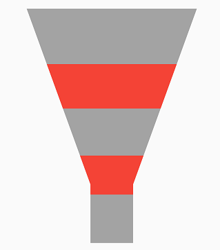

# Selection in Flutter Funnel Chart (SfFunnelChart)

The selection feature in chart let you to select a segment in a series or the series itself. This features allows you to select either individual or cluster of segments in the chart series.

 

    late SelectionBehavior _selectionBehavior;

    @override
    void initState(){
      _selectionBehavior = SelectionBehavio(
             // Enables the selection
             enable: true
      );
      super.initState();
    }

    @override
    Widget build(BuildContext context) {
      return Scaffold(
        body: Center(
          child: Container(
            child: SfFunnelChart(
              series: FunnelSeries<SalesData, String>(
                  dataSource: chartData,
                  xValueMapper: (SalesData sales, _) =>   sales.year,
                  yValueMapper: (SalesData sales, _) => sales.sales,
                  selectionBehavior: _selectionBehavior
                )
            )
          )
        )
      );
    }



## Customizing the segments

You can customize the segments using the below properties.

* [`selectedColor`](https://pub.dev/documentation/syncfusion_flutter_charts/latest/charts/SelectionBehavior/selectedColor.html) - used to change the background color of selected segment.
* [`unselectedColor`](https://pub.dev/documentation/syncfusion_flutter_charts/latest/charts/SelectionBehavior/unselectedColor.html) - used to change the background color of unselected segment.
* [`selectedBorderColor`](https://pub.dev/documentation/syncfusion_flutter_charts/latest/charts/SelectionBehavior/selectedBorderColor.html) - used to change the stroke color of the selected segment.
* [`selectedBorderWidth`](https://pub.dev/documentation/syncfusion_flutter_charts/latest/charts/SelectionBehavior/selectedBorderWidth.html) - used to change the stroke width of the selected segment.
* [`unselectedBorderColor`](https://pub.dev/documentation/syncfusion_flutter_charts/latest/charts/SelectionBehavior/unselectedBorderColor.html) - used to change the stroke color of the unselected segment.
* [`unselectedBorderWidth`](https://pub.dev/documentation/syncfusion_flutter_charts/latest/charts/SelectionBehavior/unselectedBorderWidth.html) - used to change the stroke width of the unselected segment.
* [`selectedOpacity`](https://pub.dev/documentation/syncfusion_flutter_charts/latest/charts/SelectionBehavior/selectedOpacity.html) - used to control the transparency of the selected segment.
* [`unselectedOpacity`](https://pub.dev/documentation/syncfusion_flutter_charts/latest/charts/SelectionBehavior/unselectedOpacity.html) - used to control the transparency of the unselected segment.

 
    
    late SelectionBehavior _selectionBehavior;

    @override
    void initState(){
      _selectionBehavior = SelectionBehavior(
                    // Enables the selection
                    enable: true,
                    selectedColor: Colors.red,
                    unselectedColor: Colors.grey,
                    );
      super.initState();
    }

    @override
    Widget build(BuildContext context) {
      return Scaffold(
        body: Center(
          child: Container(
            child: SfFunnelChart(
              series: FunnelSeries<SalesData, String>(
                  dataSource: chartData,
                  xValueMapper: (SalesData sales, _) =>   sales.year,
                  yValueMapper: (SalesData sales, _) => sales.sales,
                  selectionBehavior: _selectionBehavior
                )
            )
          )
        )
      );
    }



## Multi-selection

Multiple selection can be enabled using the [`enableMultiSelection`](https://pub.dev/documentation/syncfusion_flutter_charts/latest/charts/SfFunnelChart/enableMultiSelection.html) property of chart.

 

    @override
    Widget build(BuildContext context) {
        return Scaffold(
            body: Center(
                child: Container(
                    child: SfFunnelChart(
                        // Enables multiple selection
                        enableMultiSelection: true
                    )
                )
            )
        );
    }



## Selection on initial rendering

You can select a point or series programmatically on a chart using [`initialSelectedDataIndexes`](https://pub.dev/documentation/syncfusion_flutter_charts/latest/charts/FunnelSeries/initialSelectedDataIndexes.html) property of chart.

 

    @override
    Widget build(BuildContext context) {
        return Scaffold(
            body: Center(
                child: Container(
                    child: SfFunnelChart(
                        initialSelectedDataIndexes: [1, 0]
                    )
                )
            )
        );
    }



## Toggle selection

You can decide, whether to deselect the selected data point/series or remain selected when interacted with it again by setting the [`toggleSelection`](https://pub.dev/documentation/syncfusion_flutter_charts/latest/charts/SelectionBehavior/toggleSelection.html) property `true` or `false`. If set to true, deselection will be performed else the point will not get deselected.
This works even while calling public methods, in various selection modes, with multi-selection, and also on dynamic changes.
Defaults to `true`.

 
   
    late SelectionBehavior _selectionBehavior;

    @override
    void initState(){
      _selectionBehavior =   SelectionBehavior(
                enable: true,
                toggleSelection: false,
              );
      super.initState(); 
    }

    @override
    Widget build(BuildContext context) {
      return Scaffold(
        body: Center(
          child: Container(
            child: SfFunnelChart(
              series: FunnelSeries<SalesData, String>(
              dataSource: chartData1,
              xValueMapper: (ChartData data, _) => data.x,
              yValueMapper: (ChartData data, _) => data.y,
              selectionBehavior: _selectionBehavior)
        ))));
    }



Also refer [selection event](./events#onselectionchanged) for customizing the selection further.

## Methods in SelectionBehavior

### SelectDataPoints method in SelectionBehavior

The [`selectDataPoints`](https://pub.dev/documentation/syncfusion_flutter_charts/latest/charts/SelectionBehavior/selectDataPoints.html) method is used to select the data point programmatically. The required arguments are listed below.

* `pointIndex` - index of the point which needs to be selected.
* `seriesIndex` - index of the series for which the pointIndex is specified and this is an optional parameter. By default it will be considered as 0.

N> The [`enableMultiSelection`](https://pub.dev/documentation/syncfusion_flutter_charts/latest/charts/SfCartesianChart/enableMultiSelection.html) is also applicable for this but, it is based on the API values specified in the chart.



    late SfFunnelChart chart;
    late SelectionBehavior _selectionBehavior;

    @override
    void initState(){
      _selectionBehavior = SelectionBehavior(enable: true);
      super.initState();
    }

    @override
    Widget build(BuildContext context) {
    
    final List<ChartData> chartData = [
      ChartData(10, 17),
      ChartData(20, 34)
      // Add the required data
    ];
    chart = SfFunnelChart(
      series: FunnelSeries<ChartData, double>(
            dataSource: chartData,
            xValueMapper: (ChartData data, _) => data.x,
            yValueMapper: (ChartData data, _) => data.y,
            selectionBehavior: _selectionBehavior
        )
    );
    
    return Scaffold(
      body: Center(
        child: Column(
          children: <Widget>[
            FlatButton(
              child: Text('Select'),
              onPressed: select
            ),
            Container(child: chart)
          ]
        )
      )
    );
    }
    void select() {
        _selectionBehavior.selectDataPoints(1, 0);
    }

