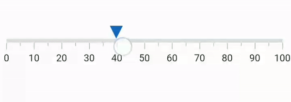

# Flutter Linear Gauge interaction

The shape and widget marker pointers in a Linear Gauge can be moved from one value to another with swipe or drag gestures.

## Interaction with marker pointers

The [`onValueChanged`](https://pub.dev/documentation/syncfusion_flutter_gauges/latest/gauges/LinearShapePointer/onValueChanged.html) callback is used to change the value of the marker pointer at run-time.

The below code snippet demonstrates updating simple marker pointer value based on swipe or drag gesture.



double shapePointerValue = 25;
  @override
  Widget build(BuildContext context) {
    return MaterialApp(
      home: Scaffold(
        body: Center(
          child: SfLinearGauge(
            markerPointers: [
              LinearShapePointer(
                  value: shapePointerValue,
                  //Changes the value of shape pointer based on interaction
                  onValueChanged: (value) {
                    setState(() {
                      shapePointerValue = value;
                    });
                  },
                  color: Colors.blue[800]),
            ],
          ),
        ),
      ),
    );
  }



The below code snippet demonstrates updating multiple marker pointer value based on swipe or drag gesture.



  double shapePointerValue = 85;
  double barPointerValue = 85;
  double widgetPointerValue = 26;
  @override
  Widget build(BuildContext context) {
    return MaterialApp(
        home: Scaffold(
            body: Center(
			child: Column(
			children: [
			SfLinearGauge(
            barPointers: [LinearBarPointer(value: shapePointerValue)],
            markerPointers: [
              LinearShapePointer(
                value: shapePointerValue,
                onValueChanged: (value) {
                  setState(() {
                    shapePointerValue = value;
                  });
                },
                color: Colors.blue[800]
              ),
            ],
          ),
		  
          SizedBox(height: 30),
          SfLinearGauge(
            barPointers: [LinearBarPointer(value: barPointerValue)],
            markerPointers: [
              LinearWidgetPointer(
			  position: LinearElementPosition.outside,
			  value: barPointerValue,
			  onValueChanged: (value) {
                  setState(() {
                    barPointerValue = value;
                  });
                },
                child: Container(
                  height: 20,
                  width: 20,
                  decoration: BoxDecoration(
                      color: Colors.orange[500], shape: BoxShape.circle)
                ),
              ),
            ],
          ),
          SizedBox(height: 25),
          SfLinearGauge(
            axisTrackStyle: LinearAxisTrackStyle(
              thickness: 10
            ),
            markerPointers: [
              LinearShapePointer(
                value: widgetPointerValue,
                shapeType: LinearShapePointerType.invertedTriangle,
                position: LinearElementPosition.cross,
                onValueChanged: (value) {
                  setState(() {
                    widgetPointerValue = value;
                  });
                },
                color: widgetPointerValue < 40
                    ? Colors.green
                    : widgetPointerValue < 80
                        ? Colors.orange
                        : Colors.red
              ),
              LinearWidgetPointer(
                value: widgetPointerValue,
                onValueChanged: (value) {
                  setState(() {
                    widgetPointerValue = value;
                  });
                },
                child: Container(
                  width: 55,
                  height: 45,
                  child: Center(
                    child: Text(
                      widgetPointerValue.toStringAsFixed(0),
                      style: TextStyle(
                        fontWeight: FontWeight.w500,
                        fontSize: 20,
                        color: widgetPointerValue < 40
                            ? Colors.green
                            : widgetPointerValue < 80
                                ? Colors.orange
                                : Colors.red
                      ),
                    ),
                  ),
                ),
                position: LinearElementPosition.outside,
              ),
            ],
            ranges: [
              LinearGaugeRange(
                  endValue: widgetPointerValue,
                  color: widgetPointerValue < 40
                      ? Colors.green
                      : widgetPointerValue < 80
                          ? Colors.orange
                          : Colors.red,
                  position: LinearElementPosition.cross)
            ],
          ),
        ],
        mainAxisAlignment: MainAxisAlignment.center
    )),    
	)
);



