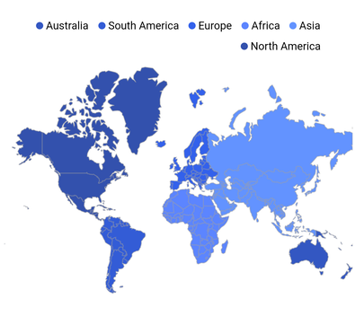

# Right to Left (RTL) in Flutter Maps (SfMaps)

## RTL rendering ways

Right to left rendering can be achieved in the following ways:

### Wrapping the SfMaps with Directionality widget

The maps can be wrapped inside the [`Directionality`](https://api.flutter.dev/flutter/widgets/Directionality-class.html) widget and you can set the [`textDirection`](https://api.flutter.dev/flutter/widgets/Directionality/textDirection.html) property to `rtl`.




@override
Widget build(BuildContext context) {
  return MaterialApp(
      home: Scaffold(
          body: Directionality(
              textDirection: TextDirection.rtl,
              child: Center(
                child: SfMaps(
                  layers: [
                    MapShapeLayer(
                      source: const MapShapeSource.asset(
                          "assets/world_map.json",
                          shapeDataField: "continent"),
                    ),
                  ],
                ),
              )
          ),
       ),
   );
}




### Changing the locale to RTL languages

The maps elements will render in right to left direction if the locale belongs to RTL languages such as (Arabic ,Persian ,Hebrew, Pashto, Urdu). It can be achieved by specifying the MaterialApp properties such as `localizationsDelegates`, `supportedLocales`, `locale` and adding the flutter_localizations package to your pubspec.yaml file.




dependencies:
  flutter_localizations:
    sdk: flutter







@override
Widget build(BuildContext context) {
   return MaterialApp(
      localizationsDelegates: [
        GlobalMaterialLocalizations.delegate,
        GlobalWidgetsLocalizations.delegate,
      ],
      supportedLocales: [
        Locale("fa", "IR"),
      ],
      locale: Locale("fa", "IR"),
      home: Scaffold(
        backgroundColor: Colors.white,
        body: SfMaps(
          layers: [
            MapShapeLayer(
              source: const MapShapeSource.asset(
                  "assets/world_map.json",
                  shapeDataField: "continent"),
            ),
          ],
        ),
      ),
   );
}




## RTL supported maps elements

### Legend

Legend items will be rendered from right to left direction. It is applicable for both shape and bubble legend with solid and bar type.




late List<PopulationModel> _data;
late MapShapeSource _mapSource;

@override
void initState() {
  super.initState();
   _data = <PopulationModel>[
      PopulationModel('Asia', 150, Color.fromRGBO(60, 120, 255, 0.8)),
      PopulationModel('Africa', 45, Color.fromRGBO(51, 102, 255, 0.8)),
      PopulationModel('Europe', 34, Color.fromRGBO(0, 57, 230, 0.8)),
      PopulationModel('South America', 25, Color.fromRGBO(0, 51, 204, 0.8)),
      PopulationModel('North America', 28, Color.fromRGBO(0, 38, 153, 0.8)),
      PopulationModel('Australia', 5, Color.fromRGBO(0, 45, 179, 0.8)),
   ];

   _mapSource = MapShapeSource.asset(
      "assets/world_map.json",
      shapeDataField: "continent",
      dataCount: _data.length,
      primaryValueMapper: (int index) => _data[index].continent,
      shapeColorValueMapper: (int index) => _data[index].color,
   );
}

@override
Widget build(BuildContext context) {
  return Scaffold(
     body: Center(
        child: Container(
          padding: const EdgeInsets.only(left: 10, right: 15, top: 30),
          height: 350,
          child: Directionality(
            textDirection: TextDirection.rtl,
            child: SfMaps(
              layers: [
                MapShapeLayer(
                  source: _mapSource,
                  legend: MapLegend(MapElement.shape),
                )
              ],
            ),
          ),
        ),
      ),
   );
}

class PopulationModel {
  const PopulationModel(
      this.continent, this.populationDensityPerSqKm, this.color);

  final String continent;
  final double populationDensityPerSqKm;
  final Color color;
}




### Tooltip

Tooltip text will be rendered from right to left direction. It is applicable for shape tooltip, bubble tooltip, and marker tooltip.




late List<PopulationModel> _data;
late MapShapeSource _mapSource;

@override
void initState() {
   super.initState();
    _data = <PopulationModel>[
      PopulationModel('Asia', 150, Color.fromRGBO(60, 120, 255, 0.8)),
      PopulationModel('Africa', 45, Color.fromRGBO(51, 102, 255, 0.8)),
      PopulationModel('Europe', 34, Color.fromRGBO(0, 57, 230, 0.8)),
      PopulationModel('South America', 25, Color.fromRGBO(0, 51, 204, 0.8)),
      PopulationModel('North America', 28, Color.fromRGBO(0, 38, 153, 0.8)),
      PopulationModel('Australia', 5, Color.fromRGBO(0, 45, 179, 0.8)),
    ];

    _mapSource = MapShapeSource.asset(
      "assets/world_map.json",
      shapeDataField: "continent",
      dataCount: _data.length,
      primaryValueMapper: (int index) => _data[index].continent,
      shapeColorValueMapper: (int index) => _data[index].color,
    );
}

@override
Widget build(BuildContext context) {
  return Scaffold(
     body: Center(
        child: Container(
          padding: const EdgeInsets.only(left: 10, right: 15, top: 30),
          height: 350,
          child: Directionality(
            textDirection: TextDirection.rtl,
            child: SfMaps(
              layers: [
                MapShapeLayer(
                  source: _mapSource,
                  shapeTooltipBuilder: (BuildContext context, int index) {
                    return Container(
                      height: 50,
                      width: 190,
                      child: Column(
                        children: [
                          Padding(
                            padding: EdgeInsets.all(5),
                            child: Row(
                              children: [
                                Text('Continent   : '),
                                Text(_data[index].continent),
                              ],
                            ),
                          ),
                          Padding(
                            padding:
                                EdgeInsets.only(left: 5, right: 5, bottom: 5),
                            child: Row(
                              children: [
                                Text('Population : '),
                                Text(_data[index]
                                        .populationDensityPerSqKm
                                        .toStringAsFixed(0) +
                                    ' per sq/km'),
                              ],
                            ),
                          ),
                        ],
                      ),
                    );
                  },
                  tooltipSettings: const MapTooltipSettings(
                    color: Colors.white,
                    strokeColor: Colors.black,
                  ),
                )
              ],
            ),
          ),
        ),
     ),
  );
}

class PopulationModel {
  const PopulationModel(
      this.continent, this.populationDensityPerSqKm, this.color);

  final String continent;
  final double populationDensityPerSqKm;
  final Color color;
}




