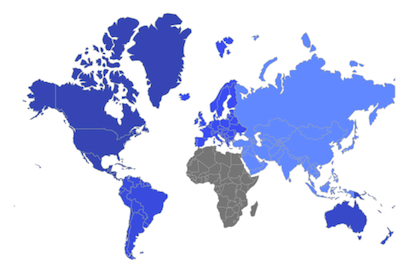

# Shape Selection in Flutter Maps (SfMaps)

You can select a shape in order to highlight that area on a map. You can use the callback for performing any action during shape selection.

## Enable shape selection

You can enable shape selection on a map using the [`MapShapeLayer.onSelectionChanged`](https://pub.dev/documentation/syncfusion_flutter_maps/latest/maps/MapShapeLayer/onSelectionChanged.html) property along with setting the [`selectedIndex`](https://pub.dev/documentation/syncfusion_flutter_maps/latest/maps/MapShapeLayer/selectedIndex.html) property. The default value of the [`selectedIndex`](https://pub.dev/documentation/syncfusion_flutter_maps/latest/maps/MapShapeLayer/selectedIndex.html) property is `-1`.

The [`onSelectionChanged`](https://pub.dev/documentation/syncfusion_flutter_maps/latest/maps/MapShapeLayer/onSelectionChanged.html) callback is used to pass the index of the selected shape when the user is selecting a shape by tapping or clicking or by programmatically.

N> You must call `setState()` in the [`MapShapeLayer.onSelectionChanged`](https://pub.dev/documentation/syncfusion_flutter_maps/latest/maps/MapShapeLayer/onSelectionChanged.html) to observe the changes in the UI.




late List<Model> data;
late MapShapeSource dataSource;
int selectedIndex = 1;

@override
void initState() {
    super.initState();
    data = const <Model>[
        Model('Asia', 'Asia', Color.fromRGBO(60, 120, 255, 0.8)),
        Model('Africa', 'Africa', Color.fromRGBO(51, 102, 255, 0.8)),
        Model('Europe', 'Europe', Color.fromRGBO(0, 57, 230, 0.8)),
        Model('South America', 'SA', Color.fromRGBO(0, 51, 204, 0.8)),
        Model('Australia', 'Australia', Color.fromRGBO(0, 45, 179, 0.8)),
        Model('North America', 'NA', Color.fromRGBO(0, 38, 153, 0.8))
    ];

    dataSource = MapShapeSource.asset(
      "assets/world_map.json",
       shapeDataField: "continent",
       dataCount: data.length,
       primaryValueMapper: (int index) => data[index].continent,
       shapeColorValueMapper: (int index) => data[index].color,
    );
}

@override
Widget build(BuildContext context) {
   return Scaffold(
      body: Center(
        child: Container(
          height: 350,
          child: Padding(
            padding: EdgeInsets.only(left: 15, right: 15),
            child: SfMaps(
              layers: [
                MapShapeLayer(
                   source: dataSource,
                   selectedIndex: selectedIndex,
                   onSelectionChanged: (int index) {
                     setState(() {
                        selectedIndex = index;
                     });
                   },
                ),
              ],
            ),
          ),
        ),
      ),
   );
}

class Model {
  const Model(this.continent, this.code, this.color);

  final String continent;
  final String code;
  final Color color;
}




N>
* Refer the [`MapSelectionSettings`](https://pub.dev/documentation/syncfusion_flutter_maps/latest/maps/MapShapeLayer/selectionSettings.html), for customizing the selected shape's appearance.

## Appearance customization

You can customize the below appearance of the selected shape.

* **Background color** - Change the background color of the selected shape using the [`MapSelectionSettings.color`](https://pub.dev/documentation/syncfusion_flutter_maps/latest/maps/MapSelectionSettings/color.html) property.
* **Stroke width** - Change the stroke width of the selected shape using the [`MapSelectionSettings.strokeWidth`](https://pub.dev/documentation/syncfusion_flutter_maps/latest/maps/MapSelectionSettings/strokeWidth.html) property.
* **Stroke color** - Change the stroke color of the selected shape using the [`MapSelectionSettings.strokeColor`](https://pub.dev/documentation/syncfusion_flutter_maps/latest/maps/MapSelectionSettings/strokeColor.html) property.




late List<Model> data;
late MapShapeSource dataSource;
int selectedIndex = 5;

@override
void initState() {
    super.initState();
    data = const <Model>[
        Model('Asia', 'Asia', Color.fromRGBO(60, 120, 255, 0.8)),
        Model('Africa', 'Africa', Color.fromRGBO(51, 102, 255, 0.8)),
        Model('Europe', 'Europe', Color.fromRGBO(0, 57, 230, 0.8)),
        Model('South America', 'SA', Color.fromRGBO(0, 51, 204, 0.8)),
        Model('Australia', 'Australia', Color.fromRGBO(0, 45, 179, 0.8)),
        Model('North America', 'NA', Color.fromRGBO(0, 38, 153, 0.8))
    ];

    dataSource = MapShapeSource.asset(
      "assets/world_map.json",
       shapeDataField: "continent",
       dataCount: data.length,
       primaryValueMapper: (int index) => data[index].continent,
       shapeColorValueMapper: (int index) => data[index].color,
    );
}

@override
Widget build(BuildContext context) {
   return Scaffold(
      body: Center(
        child: Container(
          height: 350,
          child: Padding(
            padding: EdgeInsets.only(left: 15, right: 15),
            child: SfMaps(
              layers: [
                MapShapeLayer(
                   source: dataSource,
                   selectedIndex: selectedIndex,
                   onSelectionChanged: (int index) {
                     setState(() {
                        selectedIndex = index;
                     });
                   },
                   selectionSettings: MapSelectionSettings(
                      color: Colors.orange,
                      strokeColor: Colors.red[900],
                      strokeWidth: 3,
                   ),
                ),
              ],
            ),
          ),
        ),
      ),
   );
}

class Model {
  const Model(this.continent, this.code, this.color);

  final String continent;
  final String code;
  final Color color;
}




<b>Using SfMapsTheme</b>

You can customize the below appearance of the selected shape using [`SfMapsTheme`](https://pub.dev/documentation/syncfusion_flutter_core/latest/theme/SfMapsTheme-class.html).

* **Background color** - Change the background color of the selected shape using the [`SfMapsThemeData.selectionColor`](https://pub.dev/documentation/syncfusion_flutter_core/latest/theme/SfMapsThemeData/selectionColor.html) property.
* **Stroke width** - Change the stroke width of the selected shape using the [`SfMapsThemeData.selectionStrokeWidth`](https://pub.dev/documentation/syncfusion_flutter_core/latest/theme/SfMapsThemeData/selectionStrokeWidth.html) property.
* **Stroke color** - Change the stroke color of the selected shape using the [`SfMapsThemeData.selectionStrokeColor`](https://pub.dev/documentation/syncfusion_flutter_core/latest/theme/SfMapsThemeData/selectionStrokeColor.html) property.

N> You must import the `theme.dart` library from the [`Core`](https://pub.dev/packages/syncfusion_flutter_core) package to use [`SfMapsTheme`](https://pub.dev/documentation/syncfusion_flutter_core/latest/theme/SfMapsTheme-class.html).




late List<Model> data;
late MapShapeSource dataSource;
int selectedIndex = 5;

@override
void initState() {
    super.initState();
    data = const <Model>[
        Model('Asia', 'Asia', Color.fromRGBO(60, 120, 255, 0.8)),
        Model('Africa', 'Africa', Color.fromRGBO(51, 102, 255, 0.8)),
        Model('Europe', 'Europe', Color.fromRGBO(0, 57, 230, 0.8)),
        Model('South America', 'SA', Color.fromRGBO(0, 51, 204, 0.8)),
        Model('Australia', 'Australia', Color.fromRGBO(0, 45, 179, 0.8)),
        Model('North America', 'NA', Color.fromRGBO(0, 38, 153, 0.8))
    ];

    dataSource = MapShapeSource.asset(
      "assets/world_map.json",
       shapeDataField: "continent",
       dataCount: data.length,
       primaryValueMapper: (int index) => data[index].continent,
       shapeColorValueMapper: (int index) => data[index].color,
    );
}

@override
Widget build(BuildContext context) {
    return Scaffold(
      body: Center(
        child: Container(
          height: 350,
          child: Padding(
            padding: EdgeInsets.only(left: 15, right: 15),
            child: SfMapsTheme(
              data: SfMapsThemeData(
                selectionColor: Colors.orange,
                selectionStrokeWidth: 3,
                selectionStrokeColor: Colors.red[900],
              ),
              child: SfMaps(
                layers: [
                  MapShapeLayer(
                     source: dataSource,
                     selectedIndex: selectedIndex,
                     onSelectionChanged: (int index) {
                        setState(() {
                           selectedIndex = index;
                        });
                     },
                  ),
                ],
              ),
            )
          ),
        ),
      ),
   );
}

class Model {
  const Model(this.continent, this.code, this.color);

  final String continent;
  final String code;
  final Color color;
}




