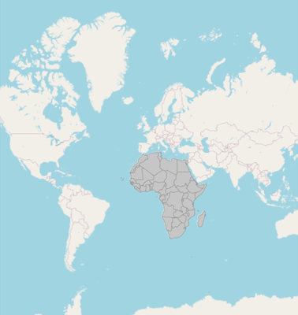
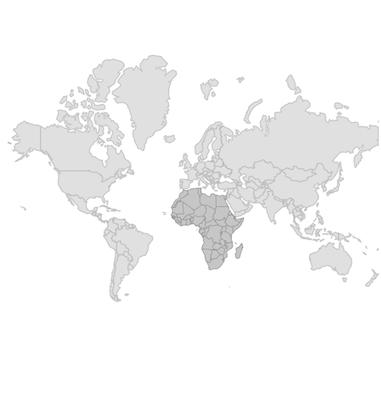
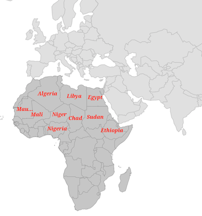
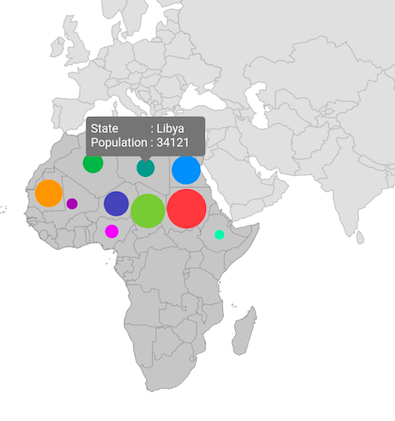
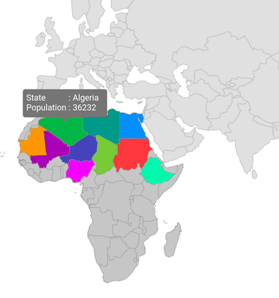
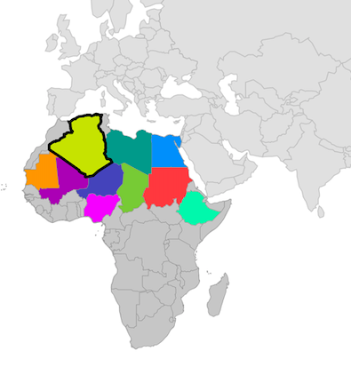
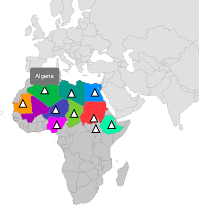

# Shape sublayer features in Maps

The shape sublayer is where geographical rendering will happen for the sublayer. This is similar to the main [`shape layer`](https://help.syncfusion.com/flutter/maps/getting-started#add-a-geojson-file-for-shape-layer) rendering. This section explains adding a shape sublayer on the shape layer and tile layer.

## Shape sublayer on tile layer

The [`sublayers`](https://pub.dev/documentation/syncfusion_flutter_maps/latest/maps/MapTileLayer/MapTileLayer.html) in [`MapTileLayer`](https://pub.dev/documentation/syncfusion_flutter_maps/latest/maps/MapTileLayer-class.html) contains collection of [`MapSublayer`](https://pub.dev/documentation/syncfusion_flutter_maps/latest/maps/MapLayer/sublayers.html).The actual geographical rendering is done in the each [`MapShapeSublayer`](https://pub.dev/documentation/syncfusion_flutter_maps/latest/maps/MapShapeSublayer-class.html). The [`source`](https://pub.dev/documentation/syncfusion_flutter_maps/latest/maps/MapShapeLayer/source.html) property of the [`MapShapeSublayer`](https://pub.dev/documentation/syncfusion_flutter_maps/latest/maps/MapShapeSublayer-class.html) is of type [`MapShapeSource`](https://pub.dev/documentation/syncfusion_flutter_maps/latest/maps/MapShapeSource-class.html). The path of the .json file which contains the GeoJSON data has to be set to the [`MapShapeSource`](https://pub.dev/documentation/syncfusion_flutter_maps/latest/maps/MapShapeSource-class.html).

The [`shapeDataField`](https://pub.dev/documentation/syncfusion_flutter_maps/latest/maps/MapShapeSource/shapeDataField.html) property of the [`MapShapeSource`](https://pub.dev/documentation/syncfusion_flutter_maps/latest/maps/MapShapeSource-class.html) is used to refer the unique field name in the .json file to identify each shapes.




MapShapeSource _sublayerSource;

@override
void initState() {
  super.initState();

  _sublayerSource = MapShapeSource.asset(
      'assets/africa.json',
      shapeDataField: 'name',
  );
}

@override
Widget build(BuildContext context) {
return Scaffold(
    body: Padding(
      padding: const EdgeInsets.only(left: 15, right: 15),
      child: SfMaps(
        layers: [
            MapTileLayer(
              urlTemplate: 'https://tile.openstreetmap.org/{z}/{x}/{y}.png',
              sublayers: [
                MapShapeSublayer(
                  source: _sublayerSource,
                ),
              ],
            ),
          ],
      ),
    ),
  );
}




N>
* Refer the [`MapTileLayer`](https://pub.dev/documentation/syncfusion_flutter_maps/latest/maps/MapTileLayer-class.html), for adding tile layer in [`SfMaps`](https://pub.dev/documentation/syncfusion_flutter_maps/latest/maps/SfMaps-class.html).

## Shape sublayer on shape layer

The [`sublayers`](https://pub.dev/documentation/syncfusion_flutter_maps/latest/maps/MapShapeLayer/MapShapeLayer.html) in [`MapShapeLayer`](https://pub.dev/documentation/syncfusion_flutter_maps/latest/maps/MapShapeLayer-class.html) contains collection of [`MapSublayer`](https://pub.dev/documentation/syncfusion_flutter_maps/latest/maps/MapLayer/sublayers.html).The actual geographical rendering is done in the each [`MapShapeSublayer`](https://pub.dev/documentation/syncfusion_flutter_maps/latest/maps/MapShapeSublayer-class.html). The [`source`](https://pub.dev/documentation/syncfusion_flutter_maps/latest/maps/MapShapeLayer/source.html) property of the [`MapShapeSublayer`](https://pub.dev/documentation/syncfusion_flutter_maps/latest/maps/MapShapeSublayer-class.html) is of type [`MapShapeSource`](https://pub.dev/documentation/syncfusion_flutter_maps/latest/maps/MapShapeSource-class.html). The path of the .json file which contains the GeoJSON data has to be set to the [`MapShapeSource`](https://pub.dev/documentation/syncfusion_flutter_maps/latest/maps/MapShapeSource-class.html).

The [`shapeDataField`](https://pub.dev/documentation/syncfusion_flutter_maps/latest/maps/MapShapeSource/shapeDataField.html) property of the [`MapShapeSource`](https://pub.dev/documentation/syncfusion_flutter_maps/latest/maps/MapShapeSource-class.html) is used to refer the unique field name in the .json file to identify each shapes.




MapShapeSource _shapeSource;
MapShapeSource _sublayerSource;

@override
void initState() {
  super.initState();
  _shapeSource = MapShapeSource.asset(
      "assets/world_map.json",
      shapeDataField: "continent",
  );

  _sublayerSource = MapShapeSource.asset(
      'assets/africa.json',
      shapeDataField: 'name',
  );
}

@override
Widget build(BuildContext context) {
return Scaffold(
    body: Padding(
      padding: const EdgeInsets.only(left: 15, right: 15),
      child: SfMaps(
        layers: [
            MapShapeLayer(
              source: _shapeSource,
              sublayers: [
                MapShapeSublayer(
                  source: _sublayerSource,
                ),
              ],
            ),
          ],
      ),
    ),
  );
}




N>
* Refer the [`MapShapeLayer`](https://pub.dev/documentation/syncfusion_flutter_maps/latest/maps/MapShapeLayer-class.html), for adding shape layer in [`SfMaps`](https://pub.dev/documentation/syncfusion_flutter_maps/latest/maps/SfMaps-class.html).

## Color and stroke color

You can change the color, strokeColor and strokeWidth of the shape sublayer using the [`color`](https://pub.dev/documentation/syncfusion_flutter_maps/latest/maps/MapShapeSublayer/color.html), [`strokeColor`](https://pub.dev/documentation/syncfusion_flutter_maps/latest/maps/MapShapeSublayer/strokeColor.html) and [`strokeWidth`](https://pub.dev/documentation/syncfusion_flutter_maps/latest/maps/MapShapeSublayer/strokeWidth.html) properties.

N> It is applicable for both tile layer and shape layer.




MapShapeSource _shapeSource;
MapShapeSource _sublayerSource;

@override
void initState() {
  super.initState();
  _shapeSource = MapShapeSource.asset(
      "assets/world_map.json",
      shapeDataField: "continent",
  );

  _sublayerSource = MapShapeSource.asset(
      'assets/africa.json',
      shapeDataField: 'name',
  );
}

@override
Widget build(BuildContext context) {
return Scaffold(
    body: Padding(
      padding: const EdgeInsets.only(left: 15, right: 15),
      child: SfMaps(
        layers: [
            MapShapeLayer(
              source: _shapeSource,
              sublayers: [
                MapShapeSublayer(
                  source: _sublayerSource,
                  color: Colors.blue[100],
                  strokeWidth: 2,
                  strokeColor: Colors.blue[800],
                ),
              ],
            ),
          ],
      ),
    ),
  );
}




## Enable data labels and its customization

You can enable data labels to the shape sublayer using the [`showDataLabels`](https://pub.dev/documentation/syncfusion_flutter_maps/latest/maps/MapShapeSublayer/showDataLabels.html) property and customize the data labels text using the [`dataLabelMapper`](https://pub.dev/documentation/syncfusion_flutter_maps/latest/maps/MapShapeSource/dataLabelMapper.html) property.

N> Refer the [`DataLabels`](https://help.syncfusion.com/flutter/maps/data-labels) section, for customizing data labels.




MapShapeSource _shapeSource;
MapShapeSource _sublayerSource;
List<DataModel> _sublayerData;
MapZoomPanBehavior _zoomPanBehavior;

@override
void initState() {
  super.initState();
  _shapeSource = MapShapeSource.asset(
     "assets/world_map.json",
     shapeDataField: "continent",
  );

  _sublayerData = <DataModel>[
    DataModel('Algeria', Colors.green, 'Algeria'),
    DataModel('Libya', Colors.teal, 'Libya'),
    DataModel('Egypt', Colors.blue, 'Egypt'),
    DataModel('Mali', Colors.purple, 'Mali'),
    DataModel('Niger', Colors.indigo, 'Niger'),
    DataModel('Nigeria', Colors.purpleAccent, 'Nigeria'),
    DataModel('Chad', Colors.lightGreen, 'Chad'),
    DataModel('Sudan', Colors.redAccent, 'Sudan'),
    DataModel('Mauritania', Colors.orange, 'Mauritania'),
    DataModel('South Sudan', Colors.lime, 'South Sudan'),
    DataModel('Ethiopia', Colors.greenAccent, 'Ethiopia')
  ];

  _sublayerSource = MapShapeSource.asset(
    'assets/africa.json',
    shapeDataField: 'name',
    dataCount: _sublayerData.length,
    primaryValueMapper: (int index) => _sublayerData[index].key,
    dataLabelMapper: (int index) => _sublayerData[index].stateCode,
  );
  _zoomPanBehavior = MapZoomPanBehavior(
    zoomLevel: 3,
    focalLatLng: MapLatLng(38.9637, 35.2433),
  );
}

@override
Widget build(BuildContext context) {
  return Scaffold(
    body: SfMaps(
      layers: [
        MapShapeLayer(
          source: _shapeSource,
          zoomPanBehavior: _zoomPanBehavior,
          sublayers: [
            MapShapeSublayer(
              source: _sublayerSource,
              showDataLabels: true,
              dataLabelSettings: const MapDataLabelSettings(
                overflowMode: MapLabelOverflow.ellipsis,
                textStyle: const TextStyle(
                    color: Colors.red,
                    fontSize: 12,
                    fontWeight: FontWeight.bold,
                    fontStyle: FontStyle.italic,
                    fontFamily: 'Times'),
              ),
            ),
          ],
        ),
      ],
    ),
  );
}

class DataModel {
  DataModel(this.key, this.color, this.stateCode);

  final String key;
  final Color color;
  final String stateCode;
}




## Add bubbles to the sublayer

You can enable bubbles to the shape sublayer using the [`bubbleSizeMapper`](https://pub.dev/documentation/syncfusion_flutter_maps/latest/maps/MapShapeSource/bubbleSizeMapper.html) property and customize the bubbles appearance using the [`bubblesSettings`](https://pub.dev/documentation/syncfusion_flutter_maps/latest/maps/MapShapeSublayer/bubbleSettings.html) property and enable tooltip for the shape sublayer bubbles using the [`bubbleTooltipBuilder`](https://pub.dev/documentation/syncfusion_flutter_maps/latest/maps/MapShapeSublayer/bubbleTooltipBuilder.html) property.

N> It is applicable for both tile layer and shape layer.

N> Refer the [`Bubbles`](https://help.syncfusion.com/flutter/maps/bubble#tooltip-for-the-bubbles) section, to know more about the bubbles customization.




MapShapeSource _shapeSource;
MapShapeSource _sublayerSource;
List<DataModel> _sublayerData;
MapZoomPanBehavior _zoomPanBehavior;

@override
void initState() {
  super.initState();
  _shapeSource = MapShapeSource.asset(
    "assets/world_map.json",
    shapeDataField: "continent",
  );

  _sublayerData = <DataModel>[
    DataModel('Algeria', Colors.green, 36232),
    DataModel('Libya', Colors.teal, 34121),
    DataModel('Egypt', Colors.blue, 43453),
    DataModel('Mali', Colors.purple, 28123),
    DataModel('Niger', Colors.indigo, 40111),
    DataModel('Nigeria', Colors.purpleAccent, 30232),
    DataModel('Chad', Colors.lightGreen, 48132),
    DataModel('Sudan', Colors.redAccent, 52654),
    DataModel('Mauritania', Colors.orange, 42231),
    DataModel('South Sudan', Colors.lime, 40421),
    DataModel('Ethiopia', Colors.greenAccent, 27198)
  ];

  _sublayerSource = MapShapeSource.asset(
    'assets/africa.json',
    shapeDataField: 'name',
    dataCount: _sublayerData.length,
    primaryValueMapper: (int index) => _sublayerData[index].key,
    bubbleColorValueMapper: (int index) => _sublayerData[index].color,
    bubbleSizeMapper: (int index) => _sublayerData[index].size,
  );
  _zoomPanBehavior = MapZoomPanBehavior(
    zoomLevel: 3,
    focalLatLng: MapLatLng(38.9637, 35.2433),
  );
}

@override
Widget build(BuildContext context) {
  return Scaffold(
    body: SfMaps(
       layers: [
          MapShapeLayer(
            source: _shapeSource,
            zoomPanBehavior: _zoomPanBehavior,
            sublayers: [
              MapShapeSublayer(
                source: _sublayerSource,
                bubbleSettings: const MapBubbleSettings(
                  minRadius: 5,
                  maxRadius: 20,
                ),
                bubbleTooltipBuilder: (BuildContext context, int index) {
                  return Container(
                    height: 40,
                    width: 120,
                    padding: const EdgeInsets.all(5),
                    child: Column(
                      children: [
                        Row(
                          children: [
                            Text('State           : ',
                                style: TextStyle(color: Colors.white)),
                            Text(_sublayerData[index].key,
                                style: TextStyle(color: Colors.white)),
                          ],
                        ),
                        Row(
                          children: [
                            Text('Population : ',
                                style: TextStyle(color: Colors.white)),
                            Text(_sublayerData[index].size.toStringAsFixed(0),
                                style: TextStyle(color: Colors.white)),
                          ],
                        ),
                      ],
                    ),
                  );
                },
              ),
            ],
          ),
        ],
      ),
   );
}

class DataModel {
  DataModel(this.key, this.color, this.size);

  final String key;
  final Color color;
  final double size;
}




## Enable tooltip for shape sublayer

You can enable tooltip for the shape sublayer using the [`shapeTooltipBuilder`](https://pub.dev/documentation/syncfusion_flutter_maps/latest/maps/MapShapeSublayer/shapeTooltipBuilder.html) property.

N> It is applicable for both tile layer and shape layer.

N> Refer the [`Tooltip`](https://help.syncfusion.com/flutter/maps/tooltip) section to know more about the tooltip customization.




MapShapeSource _shapeSource;
MapShapeSource _sublayerSource;
List<DataModel> _sublayerData;
MapZoomPanBehavior _zoomPanBehavior;

@override
void initState() {
  super.initState();
  _shapeSource = MapShapeSource.asset(
    "assets/world_map.json",
    shapeDataField: "continent",
  );

  _sublayerData = <DataModel>[
      DataModel('Algeria', Colors.green, 36232),
      DataModel('Libya', Colors.teal, 34121),
      DataModel('Egypt', Colors.blue, 43453),
      DataModel('Mali', Colors.purple, 28123),
      DataModel('Niger', Colors.indigo, 40111),
      DataModel('Nigeria', Colors.purpleAccent, 30232),
      DataModel('Chad', Colors.lightGreen, 48132),
      DataModel('Sudan', Colors.redAccent, 52654),
      DataModel('Mauritania', Colors.orange, 42231),
      DataModel('South Sudan', Colors.lime, 40421),
      DataModel('Ethiopia', Colors.greenAccent, 27198)
  ];

   _sublayerSource = MapShapeSource.asset(
      'assets/africa.json',
      shapeDataField: 'name',
      dataCount: _sublayerData.length,
      primaryValueMapper: (int index) => _sublayerData[index].key,
      shapeColorValueMapper: (int index) => _sublayerData[index].color,
   );
   _zoomPanBehavior = MapZoomPanBehavior(
      zoomLevel: 3,
      focalLatLng: MapLatLng(38.9637, 35.2433),
   );
}

@override
Widget build(BuildContext context) {
  return Scaffold(
     body: SfMaps(
        layers: [
          MapShapeLayer(
            source: _shapeSource,
            zoomPanBehavior: _zoomPanBehavior,
            sublayers: [
              MapShapeSublayer(
                source: _sublayerSource,
                shapeTooltipBuilder: (BuildContext context, int index) {
                  return Container(
                    height: 40,
                    width: 120,
                    padding: const EdgeInsets.all(5),
                    child: Column(
                      children: [
                        Row(
                          children: [
                            Text('State           : ',
                                style: TextStyle(color: Colors.white)),
                            Text(_sublayerData[index].key,
                                style: TextStyle(color: Colors.white)),
                          ],
                        ),
                        Row(
                          children: [
                            Text('Population : ',
                                style: TextStyle(color: Colors.white)),
                            Text(_sublayerData[index].size.toStringAsFixed(0),
                                style: TextStyle(color: Colors.white)),
                          ],
                        ),
                      ],
                    ),
                  );
                },
              ),
            ],
          ),
        ],
     ),
   );
}

class DataModel {
   DataModel(this.key, this.color, this.size);

   final String key;
   final Color color;
   final double size;
}




## Selection

You can enable shape sublayer selection using the [`onSelectionChanged`](https://pub.dev/documentation/syncfusion_flutter_maps/latest/maps/MapShapeSublayer/onSelectionChanged.html) callback along with setting the [`selectedIndex`](https://pub.dev/documentation/syncfusion_flutter_maps/latest/maps/MapShapeSublayer/selectedIndex.html) property.

The [`onSelectionChanged`](https://pub.dev/documentation/syncfusion_flutter_maps/latest/maps/MapShapeSublayer/onSelectionChanged.html) callback is used to pass the index of the selected shape when the user is selecting a shape by tapping or clicking or by programmatically.

If the selected shape is tapped or clicked again, the index will be passed as -1. It means that, the shape is unselected.

N> It is applicable for both tile layer and shape layer.

N> Refer the [`Shape selection`](https://help.syncfusion.com/flutter/maps/selection) section to know more about the selection feature.




MapShapeSource _shapeSource;
MapShapeSource _sublayerSource;
List<DataModel> _sublayerData;
MapZoomPanBehavior _zoomPanBehavior;
int _selectedIndex = 0;

@override
void initState() {
  super.initState();
  _shapeSource = MapShapeSource.asset(
    "assets/world_map.json",
    shapeDataField: "continent",
  );

  _sublayerData = <DataModel>[
      DataModel('Algeria', Colors.green, 36232),
      DataModel('Libya', Colors.teal, 34121),
      DataModel('Egypt', Colors.blue, 43453),
      DataModel('Mali', Colors.purple, 28123),
      DataModel('Niger', Colors.indigo, 40111),
      DataModel('Nigeria', Colors.purpleAccent, 30232),
      DataModel('Chad', Colors.lightGreen, 48132),
      DataModel('Sudan', Colors.redAccent, 52654),
      DataModel('Mauritania', Colors.orange, 42231),
      DataModel('South Sudan', Colors.lime, 40421),
      DataModel('Ethiopia', Colors.greenAccent, 27198)
  ];

   _sublayerSource = MapShapeSource.asset(
      'assets/africa.json',
      shapeDataField: 'name',
      dataCount: _sublayerData.length,
      primaryValueMapper: (int index) => _sublayerData[index].key,
      shapeColorValueMapper: (int index) => _sublayerData[index].color,
   );
   _zoomPanBehavior = MapZoomPanBehavior(
      zoomLevel: 3,
      focalLatLng: MapLatLng(38.9637, 35.2433),
   );
}

@override
Widget build(BuildContext context) {
  return Scaffold(
     body: SfMaps(
        layers: [
          MapShapeLayer(
            source: _shapeSource,
            zoomPanBehavior: _zoomPanBehavior,
            sublayers: [
              MapShapeSublayer(
                source: _sublayerSource,
                selectedIndex: _selectedIndex,
                onSelectionChanged: (int index) {
                   setState(() {
                      _selectedIndex = index;
                   });
                },
                selectionSettings: const MapSelectionSettings(
                   color: Colors.lime,
                   strokeWidth: 3,
                   strokeColor: Colors.black,
                ),
              ),
            ],
          ),
        ],
     ),
   );
}

class DataModel {
   DataModel(this.key, this.color, this.size);

   final String key;
   final Color color;
   final double size;
}




## Marker

You can show markers at any position on the map by providing latitude and longitude position to the [`MapMarker`](https://pub.dev/documentation/syncfusion_flutter_maps/latest/maps/MapMarker-class.html), which is the widget returns from the [`markerBuilder`](https://pub.dev/documentation/syncfusion_flutter_maps/latest/maps/MapShapeSublayer/markerBuilder.html) property.

The [`markerBuilder`](https://pub.dev/documentation/syncfusion_flutter_maps/latest/maps/MapShapeSublayer/markerBuilder.html) callback will be called number of times equal to the value specified in the [`initialMarkersCount`](https://pub.dev/documentation/syncfusion_flutter_maps/latest/maps/MapShapeSublayer/initialMarkersCount.html) property. The default value of the [`initialMarkersCount`](https://pub.dev/documentation/syncfusion_flutter_maps/latest/maps/MapShapeSublayer/initialMarkersCount.html) property is null.

N> It is applicable for both tile layer and shape layer.

N>
* Refer the [`Marker`](https://help.syncfusion.com/flutter/maps/markers) section to know more about the marker feature.
* Refer the [`Tooltip`](https://help.syncfusion.com/flutter/maps/tooltip) section to know more about the tooltip feature.




MapShapeSource _shapeSource;
MapShapeSource _sublayerSource;
List<DataModel> _sublayerData;
MapZoomPanBehavior _zoomPanBehavior;
List<MapLatLng> _markerData;

@override
void initState() {
  super.initState();
  _shapeSource = MapShapeSource.asset(
    "assets/world_map.json",
    shapeDataField: "continent",
  );

  _markerData = <MapLatLng>[
     MapLatLng(28.0339, 1.6596),
     MapLatLng(26.3351, 17.2283),
     MapLatLng(26.8208, 30.8025),
     MapLatLng(17.6078, 8.0817),
     MapLatLng(9.0820, 8.6753),
     MapLatLng(9.1450, 40.4897),
     MapLatLng(15.4542, 18.7322),
     MapLatLng(6.8770, 31.3070),
     MapLatLng(21.0079, -10.9408),
     MapLatLng(12.8628, 30.2176),
  ];

  _sublayerData = <DataModel>[
      DataModel('Algeria', Colors.green, 36232),
      DataModel('Libya', Colors.teal, 34121),
      DataModel('Egypt', Colors.blue, 43453),
      DataModel('Mali', Colors.purple, 28123),
      DataModel('Niger', Colors.indigo, 40111),
      DataModel('Nigeria', Colors.purpleAccent, 30232),
      DataModel('Chad', Colors.lightGreen, 48132),
      DataModel('Sudan', Colors.redAccent, 52654),
      DataModel('Mauritania', Colors.orange, 42231),
      DataModel('South Sudan', Colors.lime, 40421),
      DataModel('Ethiopia', Colors.greenAccent, 27198)
  ];

   _sublayerSource = MapShapeSource.asset(
      'assets/africa.json',
      shapeDataField: 'name',
      dataCount: _sublayerData.length,
      primaryValueMapper: (int index) => _sublayerData[index].key,
      shapeColorValueMapper: (int index) => _sublayerData[index].color,
   );
   _zoomPanBehavior = MapZoomPanBehavior(
      zoomLevel: 3,
      focalLatLng: MapLatLng(38.9637, 35.2433),
   );
}

@override
Widget build(BuildContext context) {
  return Scaffold(
     body: SfMaps(
        layers: [
          MapShapeLayer(
            source: _shapeSource,
            zoomPanBehavior: _zoomPanBehavior,
            sublayers: [
              MapShapeSublayer(
                source: _sublayerSource,
                initialMarkersCount: _markerData.length,
                markerBuilder: (BuildContext context, int index) {
                   return MapMarker(
                      latitude: _markerData[index].latitude,
                      longitude: _markerData[index].longitude,
                      iconColor: Colors.white,
                      iconStrokeWidth: 2,
                      iconStrokeColor: Colors.black,
                      iconType: MapIconType.triangle,
                      size: Size(15, 15),
                   );
                },
                markerTooltipBuilder: (BuildContext context, int index) {
                  return Padding(
                     padding: EdgeInsets.all(10),
                     child: Text(_sublayerData[index].key,
                       style: TextStyle(color: Colors.white)),
                  );
                },
              ),
            ],
          ),
        ],
     ),
   );
}

class DataModel {
   DataModel(this.key, this.color, this.size);

   final String key;
   final Color color;
   final double size;
}




