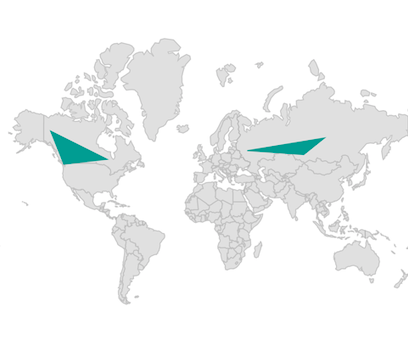
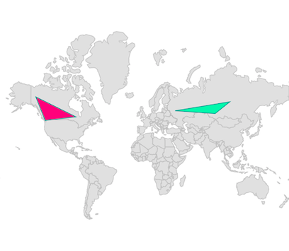
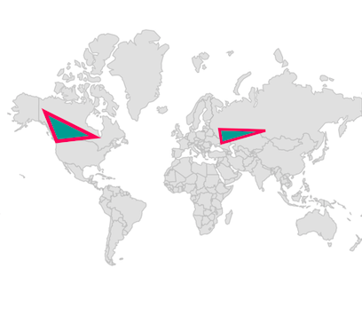
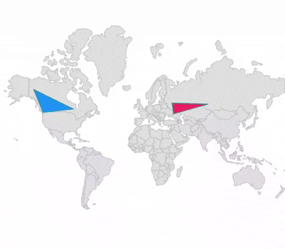
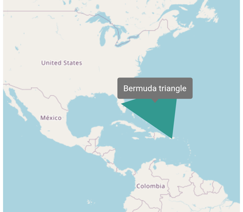
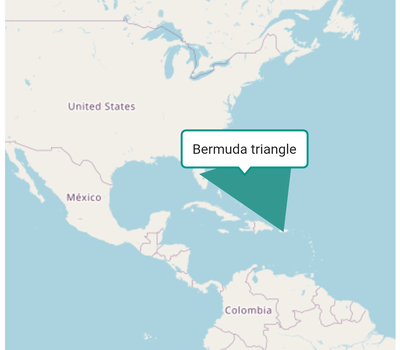
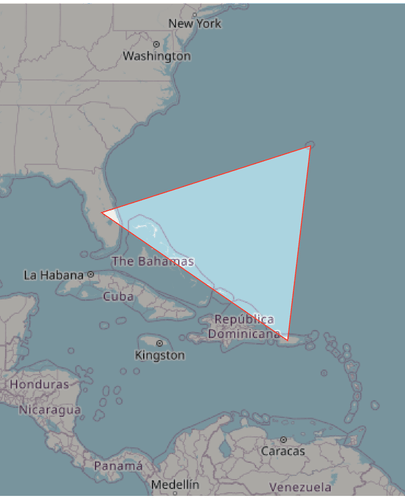

# Polygons in Flutter Maps (SfMaps)

Polygon layer is a sublayer that renders a group of [`MapPolygon`](https://pub.dev/documentation/syncfusion_flutter_maps/latest/maps/MapPolygon-class.html) on [`MapShapeLayer`](https://pub.dev/documentation/syncfusion_flutter_maps/latest/maps/MapShapeLayer-class.html) and [`MapTileLayer`](https://pub.dev/documentation/syncfusion_flutter_maps/latest/maps/MapTileLayer-class.html). This section helps to learn about how to add the polygons and customize them.

## Adding polygons

The [`polygons`](https://pub.dev/documentation/syncfusion_flutter_maps/latest/maps/MapPolygonLayer/polygons.html) is a collection of [`MapPolygon`](https://pub.dev/documentation/syncfusion_flutter_maps/latest/maps/MapPolygon-class.html). Every single [`MapPolygon`](https://pub.dev/documentation/syncfusion_flutter_maps/latest/maps/MapPolygon-class.html) connects multiple coordinates through a [`points`](https://pub.dev/documentation/syncfusion_flutter_maps/latest/maps/MapPolygon/points.html) property.

N> It is applicable for both the tile layer and shape layer.

<b>In the shape layer</b>




late List<PolygonModel> polygons;
late List<MapLatLng> polygon1;
late List<MapLatLng> polygon2;
late MapShapeSource dataSource;

@override
void initState() {
    polygon1 = <MapLatLng>[
      MapLatLng(55.7558, 37.6173),
      MapLatLng(53.7596, 87.1216),
      MapLatLng(61.5240, 105.3188),
    ];

    polygon2 = <MapLatLng>[
      MapLatLng(64.2823, -135.0000),
      MapLatLng(51.2538, -85.3232),
      MapLatLng(48.4284, -123.3656),
    ];

    polygons = <PolygonModel>[
      PolygonModel(polygon1),
      PolygonModel(polygon2),
    ];
    dataSource = MapShapeSource.asset(
      'assets/world_map.json',
      shapeDataField: 'continent',
    );
    super.initState();
}

@override
Widget build(BuildContext context) {
  return Scaffold(
    body: SfMaps(
      layers: [
        MapShapeLayer(
          source: dataSource,
          sublayers: [
            MapPolygonLayer(
              polygons: List<MapPolygon>.generate(
                polygons.length,
                (int index) {
                  return MapPolygon(
                    points: polygons[index].points,
                  );
                },
              ).toSet(),
            ),
          ],
        ),
      ],
    ),
  );
}

class PolygonModel {
  PolygonModel(this.points);
  final List<MapLatLng> points;
}




<b>In the tile layer</b>




late List<PolygonModel> polygons;
late List<MapLatLng> polygon1;
late List<MapLatLng> polygon2;

@override
void initState() {
    polygon1 = <MapLatLng>[
       MapLatLng(55.7558, 37.6173),
       MapLatLng(53.7596, 87.1216),
       MapLatLng(61.5240, 105.3188),
    ];

    polygon2 = <MapLatLng>[
      MapLatLng(64.2823, -135.0000),
      MapLatLng(51.2538, -85.3232),
      MapLatLng(48.4284, -123.3656),
    ];

    polygons = <PolygonModel>[
      PolygonModel(polygon1),
      PolygonModel(polygon2),
    ];
    super.initState();
}

@override
Widget build(BuildContext context) {
  return Scaffold(
    body: SfMaps(
      layers: [
        MapTileLayer(
          urlTemplate: 'https://tile.openstreetmap.org/{z}/{x}/{y}.png',
          sublayers: [
            MapPolygonLayer(
              polygons: List<MapPolygon>.generate(
                polygons.length,
                (int index) {
                  return MapPolygon(
                    points: polygons[index].points,
                  );
                },
              ).toSet(),
            ),
          ],
        ),
      ],
    ),
  );
}

class PolygonModel {
  PolygonModel(this.points);
  final List<MapLatLng> points;
}




## Fill color

You can apply the same color for all [`MapPolygon`](https://pub.dev/documentation/syncfusion_flutter_maps/latest/maps/MapPolygon-class.html) in the [`polygons`](https://pub.dev/documentation/syncfusion_flutter_maps/latest/maps/MapPolygonLayer/polygons.html) collection using the [`MapPolygonLayer.color`](https://pub.dev/documentation/syncfusion_flutter_maps/latest/maps/MapPolygonLayer/color.html) property. Alternatively, you can apply different colors to each [`MapPolygon`](https://pub.dev/documentation/syncfusion_flutter_maps/latest/maps/MapPolygon-class.html) in the [`polygons`](https://pub.dev/documentation/syncfusion_flutter_maps/latest/maps/MapPolygonLayer/polygons.html) collection using the individual [`MapPolygon.color`](https://pub.dev/documentation/syncfusion_flutter_maps/latest/maps/MapPolygon/color.html) property.




late List<PolygonModel> polygons;
late List<MapLatLng> polygon1;
late List<MapLatLng> polygon2;
late MapShapeSource dataSource;

@override
void initState() {
    polygon1 = <MapLatLng>[
      MapLatLng(55.7558, 37.6173),
      MapLatLng(53.7596, 87.1216),
      MapLatLng(61.5240, 105.3188),
    ];

    polygon2 = <MapLatLng>[
      MapLatLng(64.2823, -135.0000),
      MapLatLng(51.2538, -85.3232),
      MapLatLng(48.4284, -123.3656),
    ];

    polygons = <PolygonModel>[
       PolygonModel(polygon1, Colors.greenAccent),
       PolygonModel(polygon2, Colors.pinkAccent),
    ];

    dataSource = MapShapeSource.asset(
      'assets/world_map.json',
      shapeDataField: 'continent',
    );
    super.initState();
}

@override
Widget build(BuildContext context) {
  return Scaffold(
    body: SfMaps(
      layers: [
        MapShapeLayer(
          source: dataSource,
          sublayers: [
            MapPolygonLayer(
              polygons: List<MapPolygon>.generate(
                polygons.length,
                (int index) {
                  return MapPolygon(
                    points: polygons[index].points,
                    color: polygons[index].color,
                  );
                },
              ).toSet(),
            ),
          ],
        ),
      ],
    ),
  );
}

class PolygonModel {
  PolygonModel(this.points, this.color);
  final List<MapLatLng> points;
  final Color color;
}




## Stroke width and color

You can apply the same stroke width for all [`MapPolygon`](https://pub.dev/documentation/syncfusion_flutter_maps/latest/maps/MapPolygon-class.html) in the [`polygons`](https://pub.dev/documentation/syncfusion_flutter_maps/latest/maps/MapPolygonLayer/polygons.html) collection using the [`MapPolygonLayer.strokeWidth`](https://pub.dev/documentation/syncfusion_flutter_maps/latest/maps/MapPolygonLayer/strokeWidth.html) property. Alternatively, you can apply different stroke width to each [`MapPolygon`](https://pub.dev/documentation/syncfusion_flutter_maps/latest/maps/MapPolygon-class.html) in the [`polygons`](https://pub.dev/documentation/syncfusion_flutter_maps/latest/maps/MapPolygonLayer/polygons.html) collection using the individual [`MapPolygon.strokeWidth`](https://pub.dev/documentation/syncfusion_flutter_maps/latest/maps/MapPolygon/strokeWidth.html) property. The default value of the [`MapPolygonLayer.strokeWidth`](https://pub.dev/documentation/syncfusion_flutter_maps/latest/maps/MapPolygonLayer/strokeWidth.html) property is `2`.

You can apply the same stroke color for all [`MapPolygon`](https://pub.dev/documentation/syncfusion_flutter_maps/latest/maps/MapPolygon-class.html) in the [`polygons`](https://pub.dev/documentation/syncfusion_flutter_maps/latest/maps/MapPolygonLayer/polygons.html) collection using the [`MapPolygonLayer.strokeColor`](https://pub.dev/documentation/syncfusion_flutter_maps/latest/maps/MapPolygonLayer/strokeColor.html) property. Alternatively, you can apply different stroke color to each [`MapPolygon`](https://pub.dev/documentation/syncfusion_flutter_maps/latest/maps/MapPolygon-class.html) in the [`polygons`](https://pub.dev/documentation/syncfusion_flutter_maps/latest/maps/MapPolygonLayer/polygons.html) collection using the individual [`MapPolygon.strokeColor`](https://pub.dev/documentation/syncfusion_flutter_maps/latest/maps/MapPolygon/strokeColor.html) property.




late List<PolygonModel> polygons;
late List<MapLatLng> polygon1;
late List<MapLatLng> polygon2;
late MapShapeSource dataSource;

@override
void initState() {
    polygon1 = <MapLatLng>[
       MapLatLng(55.7558, 37.6173),
       MapLatLng(53.7596, 87.1216),
       MapLatLng(61.5240, 105.3188),
    ];

    polygon2 = <MapLatLng>[
      MapLatLng(64.2823, -135.0000),
      MapLatLng(51.2538, -85.3232),
      MapLatLng(48.4284, -123.3656),
    ];

    polygons = <PolygonModel>[
       PolygonModel(polygon1, 3),
       PolygonModel(polygon2, 4),
    ];
    dataSource = MapShapeSource.asset(
      'assets/world_map.json',
      shapeDataField: 'continent',
    );
    super.initState();
}

@override
Widget build(BuildContext context) {
  return Scaffold(
    body: SfMaps(
      layers: [
        MapShapeLayer(
          source: dataSource,
          sublayers: [
            MapPolygonLayer(
              polygons: List<MapPolygon>.generate(
                polygons.length,
                (int index) {
                  return MapPolygon(
                    points: polygons[index].points,
                    strokeWidth: polygons[index].width,
                    strokeColor: Colors.pink,
                  );
                },
              ).toSet(),
            ),
          ],
        ),
      ],
    ),
  );
}

class PolygonModel {
  PolygonModel(this.points, this.width);
  final List<MapLatLng> points;
  final double width;
}




## Tap

You can use the [`onTap`](https://pub.dev/documentation/syncfusion_flutter_maps/latest/maps/MapPolygon/onTap.html) callback to get a notification if the particular [`MapPolygon`](https://pub.dev/documentation/syncfusion_flutter_maps/latest/maps/MapPolygon-class.html) is tapped. You can also customize the tapped [`MapPolygon`](https://pub.dev/documentation/syncfusion_flutter_maps/latest/maps/MapPolygon-class.html) based on the index passed in the callback as shown in the below code snippet.




late List<PolygonModel> polygons;
late List<MapLatLng> polygon1;
late List<MapLatLng> polygon2;
late MapShapeSource dataSource;
late int selectedIndex;

@override
void initState() {
    polygon1 = <MapLatLng>[
       MapLatLng(55.7558, 37.6173),
       MapLatLng(53.7596, 87.1216),
       MapLatLng(61.5240, 105.3188),
    ];

    polygon2 = <MapLatLng>[
      MapLatLng(64.2823, -135.0000),
      MapLatLng(51.2538, -85.3232),
      MapLatLng(48.4284, -123.3656),
    ];

    polygons = <PolygonModel>[
      PolygonModel(polygon1),
      PolygonModel(polygon2),
    ];
    dataSource = MapShapeSource.asset(
      'assets/world_map.json',
      shapeDataField: 'continent',
    );

    selectedIndex = -1;
    super.initState();
}

@override
Widget build(BuildContext context) {
  return Scaffold(
    body: SfMaps(
      layers: [
        MapShapeLayer(
          source: dataSource,
          sublayers: [
            MapPolygonLayer(
              polygons: List<MapPolygon>.generate(
                polygons.length,
                (int index) {
                  return MapPolygon(
                    points: polygons[index].points,
                    color: selectedIndex == index ? Colors.pink : Colors.blue,
                    onTap: () {
                       setState(() {
                         selectedIndex = index;
                       });
                    }
                  );
                },
              ).toSet(),
            ),
          ],
        ),
      ],
    ),
  );
}

class PolygonModel {
  PolygonModel(this.points);
  final List<MapLatLng> points;
}




## Tooltip

You can show additional information about the polygon drawn using the [`tooltipBuilder`](https://pub.dev/documentation/syncfusion_flutter_maps/latest/maps/MapSublayer/tooltipBuilder.html) property.




late List<MapLatLng> polygon;

@override
void initState() {
   polygon = <MapLatLng>[
     MapLatLng(27.6648, -81.5158),
     MapLatLng(32.3078, -64.7505),
     MapLatLng(18.2208, -66.5901),
   ];
   super.initState();
}

@override
Widget build(BuildContext context) {
  return Scaffold(
     body: Center(
        child: Container(
          height: 400,
          width: 400,
          child: SfMaps(
            layers: [
              MapTileLayer(
                urlTemplate: 'https://tile.openstreetmap.org/{z}/{x}/{y}.png',
                initialFocalLatLng: MapLatLng(27.6648, -81.5158),
                initialZoomLevel: 3,
                sublayers: [
                  MapPolygonLayer(
                    polygons: List<MapPolygon>.generate(
                      1,
                      (int index) {
                        return MapPolygon(
                          points: polygon,
                        );
                      },
                    ).toSet(),
                    tooltipBuilder: (BuildContext context, int index) {
                      return Padding(
                        padding: EdgeInsets.all(10),
                        child: Text('Bermuda triangle',
                            style: TextStyle(color: Colors.white)),
                      );
                    },
                  ),
                ],
              ),
            ],
          ),
        ),
      ),
   );
}




## Tooltip customization

You can customize the appearance of the tooltip.

* Background color - Change the background color of the tooltip in the maps using the [`MapTooltipSettings.color`](https://pub.dev/documentation/syncfusion_flutter_maps/latest/maps/MapTooltipSettings/color.html) property.
* Stroke color - Change the stroke color of the tooltip in the maps using the [`MapTooltipSettings.strokeColor`](https://pub.dev/documentation/syncfusion_flutter_maps/latest/maps/MapTooltipSettings/strokeColor.html) property.
* Stroke width - Change the stroke width of the tooltip in the maps using the [`MapTooltipSettings.strokeWidth`](https://pub.dev/documentation/syncfusion_flutter_maps/latest/maps/MapTooltipSettings/strokeWidth.html) property.




late List<MapLatLng> polygon;

@override
void initState() {
   polygon = <MapLatLng>[
      MapLatLng(27.6648, -81.5158),
      MapLatLng(32.3078, -64.7505),
      MapLatLng(18.2208, -66.5901),
   ];
   super.initState();
}

@override
Widget build(BuildContext context) {
  return Scaffold(
     body: Center(
        child: Container(
          height: 400,
          width: 400,
          child: SfMaps(
            layers: [
              MapTileLayer(
                urlTemplate: 'https://tile.openstreetmap.org/{z}/{x}/{y}.png',
                initialFocalLatLng: MapLatLng(27.6648, -81.5158),
                initialZoomLevel: 3,
                tooltipSettings: const MapTooltipSettings(
                  color: Colors.white,
                  strokeColor: Colors.teal,
                  strokeWidth: 2,
                ),
                sublayers: [
                  MapPolygonLayer(
                    polygons: List<MapPolygon>.generate(
                      1,
                      (int index) {
                        return MapPolygon(
                          points: polygon,
                        );
                      },
                    ).toSet(),
                    tooltipBuilder: (BuildContext context, int index) {
                      return Padding(
                        padding: EdgeInsets.all(10),
                        child: Text('Bermuda triangle'),
                      );
                    },
                  ),
                ],
              ),
            ],
          ),
        ),
      ),
   );
}




## Inverted polygon

You can apply color to the inverted polygon by initializing the [`MapPolygonLayer.inverted`](https://pub.dev/documentation/syncfusion_flutter_maps/latest/maps/MapPolygonLayer/MapPolygonLayer.inverted.html) constructor. The inner polygon color is transparent and the outer portion of the polygon covered by an overlay color.

You can customize the inverted polygon using the following properties:

* **Stroke color** - Change the stroke color of the polygon using the [`strokeColor`](https://pub.dev/documentation/syncfusion_flutter_maps/latest/maps/MapPolygonLayer/strokeColor.html) property.
* **Stroke width** - Change the stroke width of the polygon using the [`strokeWidth`](https://pub.dev/documentation/syncfusion_flutter_maps/latest/maps/MapPolygonLayer/strokeWidth.html) property. The default value of the `strokeWidth` property is `1`.
* **Overlay color** - Change the outer portion color of the polygon using the [`color`](https://pub.dev/documentation/syncfusion_flutter_maps/latest/maps/MapPolygonLayer/color.html) property.
* **Tooltip** - You can enable tooltip for the inverted polygon using the [`tooltipBuilder`](https://pub.dev/documentation/syncfusion_flutter_maps/latest/maps/MapSublayer/tooltipBuilder.html) property.

N> It is applicable for both the tile layer and shape layer.

I> The individual polygon customization like [`MapPolygon.color`](https://pub.dev/documentation/syncfusion_flutter_maps/latest/maps/MapPolygon/color.html), [`MapPolygon.strokeColor`](https://pub.dev/documentation/syncfusion_flutter_maps/latest/maps/MapPolygon/strokeColor.html) and [`MapPolygon.strokeWidth`](https://pub.dev/documentation/syncfusion_flutter_maps/latest/maps/MapPolygon/strokeWidth.html) are not supported for the inverted polygon.




late MapZoomPanBehavior zoomPanBehavior;
late List<MapLatLng> _polygon;

@override
void initState() {
   _polygon = <MapLatLng>[
      MapLatLng(27.6648, -81.5158),
      MapLatLng(32.3078, -64.7505),
      MapLatLng(18.2208, -66.5901),
   ];

   zoomPanBehavior = MapZoomPanBehavior(zoomLevel: 4);
   super.initState();
}

@override
Widget build(BuildContext context) {
  return Scaffold(
     body: SfMaps(
        layers: [
          MapTileLayer(
            urlTemplate: 'https://tile.openstreetmap.org/{z}/{x}/{y}.png',
            initialFocalLatLng: MapLatLng(25.0119, -73.4842),
            sublayers: [
              MapPolygonLayer.inverted(
                polygons: List<MapPolygon>.generate(
                  1,
                  (int index) {
                    return MapPolygon(
                      points: _polygon,
                    );
                  },
                ).toSet(),
                color: Colors.black.withOpacity(0.3),
                strokeColor: Colors.red,
                strokeWidth: 1,
              ),
            ],
            zoomPanBehavior: zoomPanBehavior,
          ),
        ],
      ),
   );
}




N> Refer [`tooltip`](https://pub.dev/documentation/syncfusion_flutter_maps/latest/maps/MapSublayer/tooltipBuilder.html) section, for adding and customizing tooltip to the inverted polygon.
