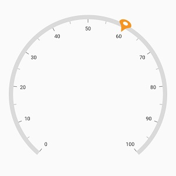
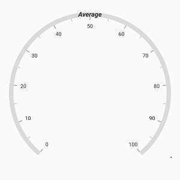
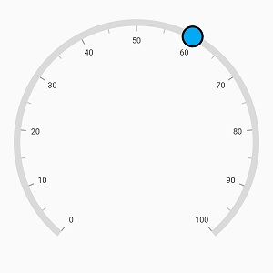
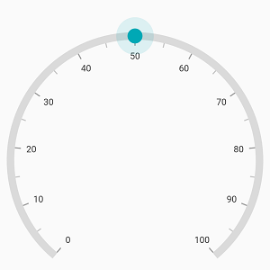
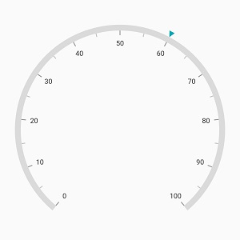

# Marker pointer in Flutter Radial Gauge (SfRadialGauge)

Different types of markers are used to mark the pointer values in a scale. You can change the marker type using the [`markerType`](https://pub.dev/documentation/syncfusion_flutter_gauges/latest/gauges/MarkerPointer/markerType.html) property. 


@override
Widget build(BuildContext context) {
  return Scaffold(
    body: Center(
              child: SfRadialGauge(
                axes: <RadialAxis>[RadialAxis(
                  pointers: <GaugePointer>[MarkerPointer(value: 60)]
                )],
              )
            ),
          );
        }



Gauge supports the following types of marker:

* Circle
* Diamond
* Image
* Inverted triangle
* Rectangle
* Text
* Triangle

## Image pointer

Image is used to denote the current pointer values instead of shape. It can be achieved by specifying the  [`markerType`](https://pub.dev/documentation/syncfusion_flutter_gauges/latest/gauges/MarkerPointer/markerType.html) as image and specifying the [`imageUrl`](https://pub.dev/documentation/syncfusion_flutter_gauges/latest/gauges/MarkerPointer/imageUrl.html) property of marker pointer.



@override
Widget build(BuildContext context) {
  return Scaffold(
    body: Center(
              child: SfRadialGauge(
                axes: <RadialAxis>[RadialAxis(
                  pointers: <GaugePointer>[MarkerPointer(value: 60,
                      markerType: MarkerType.image,markerHeight: 30,
                       markerWidth: 30,
                      imageUrl: 'images/pin.png')]
                )],
              )
            ),
          );
        }



## Text pointer

Text is used to denote the current pointer value instead of any marker shape. It can be achieved by setting the [`markerType`](https://pub.dev/documentation/syncfusion_flutter_gauges/latest/gauges/MarkerPointer/markerType.html)  as text. The provided text can be customized using the [`textStyle`](https://pub.dev/documentation/syncfusion_flutter_gauges/latest/gauges/MarkerPointer/textStyle.html) property of marker pointer.



@override
Widget build(BuildContext context) {
  return Scaffold(
    body: Center(
              child: SfRadialGauge(
                axes: <RadialAxis>[RadialAxis(
                  pointers: <GaugePointer>[MarkerPointer(value: 50,
                      markerType: MarkerType.text, text: 'Average',
                    textStyle: GaugeTextStyle(fontSize: 15,
                     fontWeight: FontWeight.bold,
                        fontStyle: FontStyle.italic)
                  )]
                )],
              )
            ),
          );
        }



## Marker Customization

The marker pointer can be customized using the following properties:

* [`color`](https://pub.dev/documentation/syncfusion_flutter_gauges/latest/gauges/MarkerPointer/color.html) – Allows to customize the marker color.
* [`markerHeight`](https://pub.dev/documentation/syncfusion_flutter_gauges/latest/gauges/MarkerPointer/markerHeight.html) – Allows to specify the marker height.
* [`markerWidth`](https://pub.dev/documentation/syncfusion_flutter_gauges/latest/gauges/MarkerPointer/markerWidth.html) – Allows to specify the marker width.
* [`borderColor`](https://pub.dev/documentation/syncfusion_flutter_gauges/latest/gauges/MarkerPointer/borderColor.html) – Allows to specify the border color for the marker.
* [`borderWidth`](https://pub.dev/documentation/syncfusion_flutter_gauges/latest/gauges/MarkerPointer/borderWidth.html) –  Allows to specify the border width of the marker.



@override
Widget build(BuildContext context) {
  return Scaffold(
    body: Center(
              child: SfRadialGauge(
                axes: <RadialAxis>[RadialAxis(
                  pointers: <GaugePointer>[MarkerPointer(value: 60, 
                  markerHeight: 30, markerWidth: 30,
                      markerType: MarkerType.circle, color: Colors.lightBlue,
                      borderWidth: 3, borderColor: Colors.black)]
                )],
              )
            ),
          );
        }



**Marker elevation**

The marker pointer can be elevated by rendering its shadow behind it and the z- coordinate position at which the shadow can be positioned relative to the marker can be controlled by the [`elevation`](https://pub.dev/documentation/syncfusion_flutter_gauges/latest/gauges/MarkerPointer/elevation.html) property.



@override
Widget build(BuildContext context) {
    return Scaffold(
      body: Center(
          child: SfRadialGauge(
        axes: <RadialAxis>[
          RadialAxis(pointers: <GaugePointer>[
            MarkerPointer(
                value: 60, markerHeight: 20, markerWidth: 20, elevation: 4)
          ])
        ],
      )),
    );
  }



The shadow color of the pointer is black by default and the default value of [`elevation`](https://pub.dev/documentation/syncfusion_flutter_gauges/latest/gauges/MarkerPointer/elevation.html) is 0.

N> The [`elevation`](https://pub.dev/documentation/syncfusion_flutter_gauges/latest/gauges/MarkerPointer/elevation.html) property applies to all the marker types except [`MarkerType.image`](https://pub.dev/documentation/syncfusion_flutter_gauges/latest/gauges/MarkerType-class.html) and [`MarkerType.text`](https://pub.dev/documentation/syncfusion_flutter_gauges/latest/gauges/MarkerType-class.html).

**Marker overlay**

The marker overlay rendered around the marker when the marker is dragged. When [`enableDragging`](https://pub.dev/documentation/syncfusion_flutter_gauges/latest/gauges/GaugePointer/enableDragging.html) property of marker is set as true and while dragging the marker, the overlay will come around the marker pointer.



  @override
  Widget build(BuildContext context) {
    return Scaffold(
      body: Center(
          child: SfRadialGauge(
        axes: <RadialAxis>[
          RadialAxis(pointers: <GaugePointer>[
            MarkerPointer(
                value: 60,
                markerHeight: 20,
                markerWidth: 20,
                enableDragging: true,
                markerType: MarkerType.circle)
          ])
        ],
      )),
    );
  }



By default, the [`overlayRadius`](https://pub.dev/documentation/syncfusion_flutter_gauges/latest/gauges/MarkerPointer/overlayRadius.html) is calculated based on the provided [`markerHeight`](https://pub.dev/documentation/syncfusion_flutter_gauges/latest/gauges/MarkerPointer/markerHeight.html) and [`markerWidth`](https://pub.dev/documentation/syncfusion_flutter_gauges/latest/gauges/MarkerPointer/markerWidth.html) property and [`overlayColor`](https://pub.dev/documentation/syncfusion_flutter_gauges/latest/gauges/MarkerPointer/overlayColor.html) is considered based on [`marker color`](https://pub.dev/documentation/syncfusion_flutter_gauges/latest/gauges/MarkerPointer/color.html). The properties are used to customize the overlay color and its radius,

* [`overlayColor`](https://pub.dev/documentation/syncfusion_flutter_gauges/latest/gauges/MarkerPointer/overlayColor.html) – Allows customizing the overlay color.

* [`overlayRadius`](https://pub.dev/documentation/syncfusion_flutter_gauges/latest/gauges/MarkerPointer/overlayRadius.html) – Allows customizing the overlay radius.



  @override
  Widget build(BuildContext context) {
    return Scaffold(
      body: Center(
          child: SfRadialGauge(
        axes: <RadialAxis>[
          RadialAxis(pointers: <GaugePointer>[
            MarkerPointer(
                value: 60,
                markerHeight: 20,
                markerWidth: 20,
                enableDragging: true,
                overlayRadius: 15,
                overlayColor: Colors.red.withOpacity(0.12),
                markerType: MarkerType.circle)
          ])
        ],
      )),
    );
  }



N> The marker overlay applies to all the marker types except [`MarkerType.image`](https://pub.dev/documentation/syncfusion_flutter_gauges/latest/gauges/MarkerType-class.html) and [`MarkerType.text`](https://pub.dev/documentation/syncfusion_flutter_gauges/latest/gauges/MarkerType-class.html).

## Position customization

The marker pointer can be moved near or far from its actual position using the [`markerOffset`](https://pub.dev/documentation/syncfusion_flutter_gauges/latest/gauges/MarkerPointer/markerOffset.html) and [`offsetUnit`](https://pub.dev/documentation/syncfusion_flutter_gauges/latest/gauges/MarkerPointer/offsetUnit.html) properties. 

When you set [`offsetUnit`](https://pub.dev/documentation/syncfusion_flutter_gauges/latest/gauges/MarkerPointer/offsetUnit.html) to logical pixel, then the marker pointer will be moved based on the logical pixel value. If you set [`offsetUnit`](https://pub.dev/documentation/syncfusion_flutter_gauges/latest/gauges/MarkerPointer/offsetUnit.html) to factor, then provided factor will be multiplied with the axis radius value, and then the pointer will be moved to corresponding value. The default value of [`offsetUnit`](https://pub.dev/documentation/syncfusion_flutter_gauges/latest/gauges/MarkerPointer/offsetUnit.html) is GaugeSizeUnit.logicalPixel.



@override
Widget build(BuildContext context) {
  return Scaffold(
    body: Center(
              child: SfRadialGauge(
                axes: <RadialAxis>[RadialAxis( radiusFactor: 0.9, centerY: 0.65,
                  pointers: <GaugePointer>[MarkerPointer(value: 60,
                    markerOffset: -5
                    )
                  ]
                )],
              )
            ),
          );
        }



