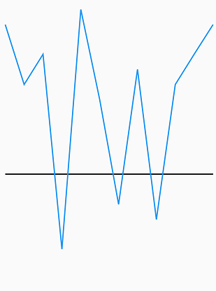
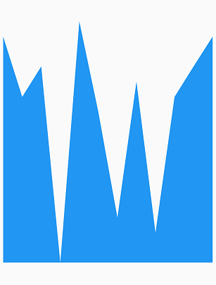

# Getting started with Flutter Spark charts

This section explains the steps required to populate the spark charts with data, data labels, marker and trackball. This section covers only the minimal features needed to know to get started with the spark charts.

## Add Flutter Spark charts to an application

Create a simple project using the instructions given in the [Getting Started with your first Flutter app](https://flutter.dev/docs/get-started/test-drive?tab=vscode#create-app) documentation.

**Add dependency**

Add the Syncfusion Flutter Chart dependency to your pub spec file.

 

    dependencies:

    syncfusion_flutter_charts: ^xx.x.xx



> **NOTE** 
Here **xx.x.xx** denotes the current version of [`Syncfusion Flutter Charts`](https://pub.dev/packages/syncfusion_flutter_charts/versions) package.

**Get packages**

Run the following command to get the required packages.

 

    $ flutter pub get



**Import package**

Import the following package in your Dart code.

 

    import 'package:syncfusion_flutter_charts/sparkcharts.dart';



## Initialize spark charts

Once the package has been imported, initialize the spark charts as a child of any widget. Here, as we are rendering Line chart, initialize [`SfSparkLineChart`](https://pub.dev/documentation/syncfusion_flutter_charts/latest/sparkcharts/SfSparkLineChart-class.html) widget as a child of Container widget.

 

    @override
    Widget build(BuildContext context) {
        return Scaffold(
            body: Center(
                child: Container(
                    //Initialize the spark charts
                    child: SfSparkLineChart()
                )
            )
        );
    }



## Bind data source

The `data` property is used for binding data to the spark charts. This property takes the list value as input. 

 

    @override
    Widget build(BuildContext context) {
        return Scaffold(
            body: Center(
                child: Container(
                    //Initialize the spark line chart
                    child: SfSparkLineChart(
                         data: <double>[
                             10,6, 8, -5, 11, 5, -2, 7, -3, 6, 8, 10
                         ]
                    )
                ),
            )
        );
    }



## Spark charts types

You can initialize the required spark charts type by specifying the widget name to [`SfSparkLineChart`](https://pub.dev/documentation/syncfusion_flutter_charts/latest/sparkcharts/SfSparkLineChart-class.html), [`SfSparkAreaChart`](https://pub.dev/documentation/syncfusion_flutter_charts/latest/sparkcharts/SfSparkAreaChart-class.html), [`SfSparkBarChart`](https://pub.dev/documentation/syncfusion_flutter_charts/latest/sparkcharts/SfSparkBarChart-class.html), [`SfSparkLWinLossChart`](https://pub.dev/documentation/syncfusion_flutter_charts/latest/sparkcharts/SfSparkLWinLossChart-class.html). Here, the spark chart type has been set to [`SfSparkAreaChart`](https://pub.dev/documentation/syncfusion_flutter_charts/latest/sparkcharts/SfSparkAreaChart-class.html).

 

    @override
    Widget build(BuildContext context) {
        return Scaffold(
            body: Center(
                child: Container(
                    //Initialize the spark area chart
                    child: SfSparkAreaChart(
                        axisLineWidth:0,
                         data: <double>[
                             10,6, 8, -5, 11, 5, -2, 7, -3, 6, 8, 10
                        ]
                    )
                ),
            )
        );
    }



## Enable data label

You can add data labels to improve the readability of the chart using the [`labelDisplayMode`](https://pub.dev/documentation/syncfusion_flutter_charts/latest/sparkcharts/SfSparkLineChart/labelDisplayMode.html) property.

 

    @override
    Widget build(BuildContext context) {
        return Scaffold(
            body: Center(
                child: Container(
                    //Initialize spark line chart
                    child: SfSparkLineChart(
                        //Enable data label
                        labelDisplayMode: SparkChartLabelDisplayMode.all,
                        data: <double>[
                            10,6, 8, -5, 11, 5, -2, 7, -3, 6, 8, 10
                        ]
                    )
                )
            )
        );
    }



## Enable trackball for spark chart

The spark charts displays additional information through trackball when touched on a specific location of the chart area. You can enable trackball by setting the [`trackball`](https://pub.dev/documentation/syncfusion_flutter_charts/latest/sparkcharts/SfSparkLineChart/trackball.html) property in [`SparkChartTrackball`](https://pub.dev/documentation/syncfusion_flutter_charts/latest/sparkcharts/SparkChartTrackball-class.html). Once it is activated, it will appear in the UI and move based on your touch movement until you stop touching on the chart.

 

    @override
    Widget build(BuildContext context) {
        return Scaffold(
            body: Center(
                child: Container(
                    child: SfSparkLineChart(
                        //Enable the trackball
                        trackball: SparkChartTrackball(
                            activationMode: SparkChartActivationMode.tap
                        ),
                        data: <double>[
                            10,6, 8, -5, 11, 5, -2, 7, -3, 6, 8, 10
                        ]
                    )
                )
            )
        );
    }



