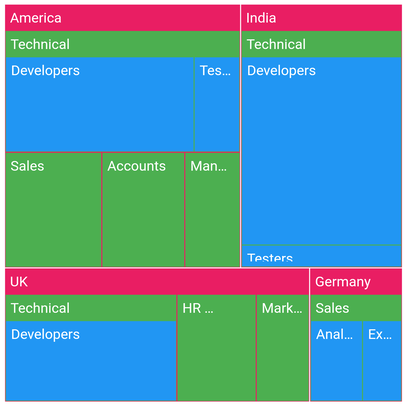
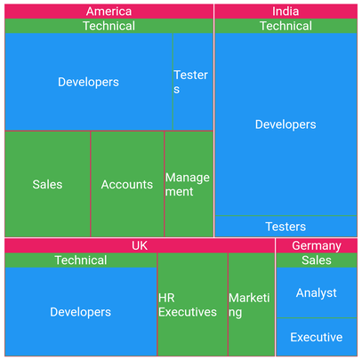

# Labels in the Flutter Treemap

You can add any type of widgets like text widget to improve the readability of the individual tiles by providing brief descriptions on labels.

## Add labels

You can add labels on the tiles using the `TreemapLevel.labelBuilder` callback which is available in the `SfTreemap.levels` collection.




List<JobVacancyModel> _source;

@override
void initState() {
   _source = <JobVacancyModel>[
      JobVacancyModel(country: 'America', job: 'Sales', vacancy: 70),
      JobVacancyModel(
          country: 'America', job: 'Technical', group: 'Testers', vacancy: 35),
      JobVacancyModel(
          country: 'America',
          job: 'Technical',
          group: 'Developers',
          role: 'Windows',
          vacancy: 105),
      JobVacancyModel(
          country: 'America',
          job: 'Technical',
          group: 'Developers',
          role: 'Web',
          vacancy: 40),
      JobVacancyModel(country: 'America', job: 'Management', vacancy: 40),
      JobVacancyModel(country: 'America', job: 'Accounts', vacancy: 60),
      JobVacancyModel(
          country: 'India', job: 'Technical', group: 'Testers', vacancy: 25),
      JobVacancyModel(
          country: 'India',
          job: 'Technical',
          group: 'Developers',
          role: 'Windows',
          vacancy: 155),
      JobVacancyModel(
          country: 'India',
          job: 'Technical',
          group: 'Developers',
          role: 'Web',
          vacancy: 60),
      JobVacancyModel(
          country: 'Germany', job: 'Sales', group: 'Executive', vacancy: 30),
      JobVacancyModel(
          country: 'Germany', job: 'Sales', group: 'Analyst', vacancy: 40),
      JobVacancyModel(
          country: 'UK',
          job: 'Technical',
          group: 'Developers',
          role: 'Windows',
          vacancy: 100),
      JobVacancyModel(
          country: 'UK',
          job: 'Technical',
          group: 'Developers',
          role: 'Web',
          vacancy: 30),
      JobVacancyModel(country: 'UK', job: 'HR Executives', vacancy: 60),
      JobVacancyModel(country: 'UK', job: 'Marketing', vacancy: 40),
   ];
   super.initState();
}

@override
Widget build(BuildContext context) {
  return Scaffold(
     body: SfTreemap(
        dataCount: _source.length,
        weightValueMapper: (int index) {
          return _source[index].vacancy;
        },
        levels: [
          TreemapLevel(
            groupMapper: (int index) => _source[index].country,
            color: Colors.pink,
            labelBuilder: (BuildContext context, TreemapTile tile) {
              return Padding(
                padding: EdgeInsets.all(5),
                child: Text(tile.group),
              );
            },
          ),
          TreemapLevel(
            groupMapper: (int index) => _source[index].job,
            color: Colors.green,
            labelBuilder: (BuildContext context, TreemapTile tile) {
              return Padding(
                padding: EdgeInsets.all(5),
                child: Text(tile.group),
              );
            },
          ),
          TreemapLevel(
            groupMapper: (int index) => _source[index].group,
            color: Colors.blue,
            labelBuilder: (BuildContext context, TreemapTile tile) {
              return Padding(
                padding: EdgeInsets.all(5),
                child: Text(tile.group),
              );
            },
          ),
        ],
      ),
   );
}

class JobVacancyModel {
  const JobVacancyModel(
      {this.country, this.job, this.group, this.role, this.vacancy});
  final String country;
  final String job;
  final String group;
  final String role;
  final double vacancy;
}




## Overflow mode

You can trim or fade the label when it is overflowed from the tile using the [`Text.overflow`](https://api.flutter.dev/flutter/widgets/Text/overflow.html) property. The possible values are `visible`, `ellipsis`, `clip` and `fade`. The default value of the [`Text.overflow`](https://api.flutter.dev/flutter/widgets/Text/overflow.html)property is `TextOverflow.visible`.

By default, the labels will render even if it overflows from the tile.




List<JobVacancyModel> _source;

@override
void initState() {
   _source = <JobVacancyModel>[
      JobVacancyModel(country: 'America', job: 'Sales', vacancy: 70),
      JobVacancyModel(
          country: 'America', job: 'Technical', group: 'Testers', vacancy: 35),
      JobVacancyModel(
          country: 'America',
          job: 'Technical',
          group: 'Developers',
          role: 'Windows',
          vacancy: 105),
      JobVacancyModel(
          country: 'America',
          job: 'Technical',
          group: 'Developers',
          role: 'Web',
          vacancy: 40),
      JobVacancyModel(country: 'America', job: 'Management', vacancy: 40),
      JobVacancyModel(country: 'America', job: 'Accounts', vacancy: 60),
      JobVacancyModel(
          country: 'India', job: 'Technical', group: 'Testers', vacancy: 25),
      JobVacancyModel(
          country: 'India',
          job: 'Technical',
          group: 'Developers',
          role: 'Windows',
          vacancy: 155),
      JobVacancyModel(
          country: 'India',
          job: 'Technical',
          group: 'Developers',
          role: 'Web',
          vacancy: 60),
      JobVacancyModel(
          country: 'Germany', job: 'Sales', group: 'Executive', vacancy: 30),
      JobVacancyModel(
          country: 'Germany', job: 'Sales', group: 'Analyst', vacancy: 40),
      JobVacancyModel(
          country: 'UK',
          job: 'Technical',
          group: 'Developers',
          role: 'Windows',
          vacancy: 100),
      JobVacancyModel(
          country: 'UK',
          job: 'Technical',
          group: 'Developers',
          role: 'Web',
          vacancy: 30),
      JobVacancyModel(country: 'UK', job: 'HR Executives', vacancy: 60),
      JobVacancyModel(country: 'UK', job: 'Marketing', vacancy: 40),
   ];
   super.initState();
}

@override
Widget build(BuildContext context) {
  return Scaffold(
     body: SfTreemap(
        dataCount: _source.length,
        weightValueMapper: (int index) {
          return _source[index].vacancy;
        },
        levels: [
          TreemapLevel(
            groupMapper: (int index) => _source[index].country,
            color: Colors.pink,
            labelBuilder: (BuildContext context, TreemapTile tile) {
              return Padding(
                padding: EdgeInsets.all(5),
                child: Text(
                  tile.group,
                  overflow: TextOverflow.ellipsis,
                ),
              );
            },
          ),
          TreemapLevel(
            groupMapper: (int index) => _source[index].job,
            color: Colors.green,
            labelBuilder: (BuildContext context, TreemapTile tile) {
              return Padding(
                padding: EdgeInsets.all(5),
                child: Text(
                  tile.group,
                  overflow: TextOverflow.ellipsis,
                ),
              );
            },
          ),
          TreemapLevel(
            groupMapper: (int index) => _source[index].group,
            color: Colors.blue,
            labelBuilder: (BuildContext context, TreemapTile tile) {
              return Padding(
                padding: EdgeInsets.all(5),
                child: Text(
                  tile.group,
                  overflow: TextOverflow.ellipsis,
                ),
              );
            },
          ),
        ],
      ),
   );
}

class JobVacancyModel {
  const JobVacancyModel(
      {this.country, this.job, this.group, this.role, this.vacancy});
  final String country;
  final String job;
  final String group;
  final String role;
  final double vacancy;
}




## Alignment

You can change the labels alignment by wrapping the text widget using the [`Align`](https://api.flutter.dev/flutter/widgets/Align-class.html) widget and set the [`alignment`](https://api.flutter.dev/flutter/widgets/Align/alignment.html) property.




List<JobVacancyModel> _source;

@override
void initState() {
   _source = <JobVacancyModel>[
      JobVacancyModel(country: 'America', job: 'Sales', vacancy: 70),
      JobVacancyModel(
          country: 'America', job: 'Technical', group: 'Testers', vacancy: 35),
      JobVacancyModel(
          country: 'America',
          job: 'Technical',
          group: 'Developers',
          role: 'Windows',
          vacancy: 105),
      JobVacancyModel(
          country: 'America',
          job: 'Technical',
          group: 'Developers',
          role: 'Web',
          vacancy: 40),
      JobVacancyModel(country: 'America', job: 'Management', vacancy: 40),
      JobVacancyModel(country: 'America', job: 'Accounts', vacancy: 60),
      JobVacancyModel(
          country: 'India', job: 'Technical', group: 'Testers', vacancy: 25),
      JobVacancyModel(
          country: 'India',
          job: 'Technical',
          group: 'Developers',
          role: 'Windows',
          vacancy: 155),
      JobVacancyModel(
          country: 'India',
          job: 'Technical',
          group: 'Developers',
          role: 'Web',
          vacancy: 60),
      JobVacancyModel(
          country: 'Germany', job: 'Sales', group: 'Executive', vacancy: 30),
      JobVacancyModel(
          country: 'Germany', job: 'Sales', group: 'Analyst', vacancy: 40),
      JobVacancyModel(
          country: 'UK',
          job: 'Technical',
          group: 'Developers',
          role: 'Windows',
          vacancy: 100),
      JobVacancyModel(
          country: 'UK',
          job: 'Technical',
          group: 'Developers',
          role: 'Web',
          vacancy: 30),
      JobVacancyModel(country: 'UK', job: 'HR Executives', vacancy: 60),
      JobVacancyModel(country: 'UK', job: 'Marketing', vacancy: 40),
   ];
   super.initState();
}

@override
Widget build(BuildContext context) {
  return Scaffold(
     body: SfTreemap(
        dataCount: _source.length,
        weightValueMapper: (int index) {
          return _source[index].vacancy;
        },
        levels: [
          TreemapLevel(
            groupMapper: (int index) => _source[index].country,
            color: Colors.pink,
            labelBuilder: (BuildContext context, TreemapTile tile) {
               return Align(
                  alignment: Alignment.center,
                  child: Text(tile.group),
               );
            },
          ),
          TreemapLevel(
            groupMapper: (int index) => _source[index].job,
            color: Colors.green,
             labelBuilder: (BuildContext context, TreemapTile tile) {
               return Align(
                  alignment: Alignment.center,
                  child: Text(tile.group),
               );
             },
          ),
          TreemapLevel(
            groupMapper: (int index) => _source[index].group,
            color: Colors.blue,
             labelBuilder: (BuildContext context, TreemapTile tile) {
                return Align(
                   alignment: Alignment.center,
                   child: Text(tile.group),
                );
             },
          ),
        ],
      ),
   );
}

class JobVacancyModel {
  const JobVacancyModel(
      {this.country, this.job, this.group, this.role, this.vacancy});
  final String country;
  final String job;
  final String group;
  final String role;
  final double vacancy;
}




