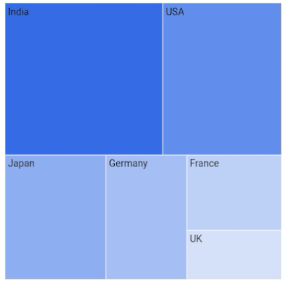

# Tile selection in Flutter Treemap (SfTreemap)

You can select a tile in order to highlight that area on a treemap. You can use the callback for performing any action during tile selection.

## Enable tile selection

You can enable tile selection on a treemap using the [`SfTreemap.onSelectionChanged`](https://pub.dev/documentation/syncfusion_flutter_treemap/latest/treemap/SfTreemap/onSelectionChanged.html) property. The descendant tiles of the selected tile are also selected along with the selected tile when doing selection for hierarchical level.

The [`onSelectionChanged`](https://pub.dev/documentation/syncfusion_flutter_treemap/latest/treemap/SfTreemap/onSelectionChanged.html) callback will be called with the details of the selected tile when the user is selecting a tile by tapping and you will be able to do any specific functionalities like showing pop-up or navigate to a different page.




late List<SocialMediaUsers> _source;

@override
void initState() {
   _source = <SocialMediaUsers>[
      SocialMediaUsers('India', 'Facebook', 25.4),
      SocialMediaUsers('USA', 'Instagram', 19.11),
      SocialMediaUsers('Japan', 'Facebook', 13.3),
      SocialMediaUsers('Germany', 'Instagram', 10.65),
      SocialMediaUsers('France', 'Twitter', 7.54),
      SocialMediaUsers('UK', 'Instagram', 4.93),
   ];
   super.initState();
}

@override
Widget build(BuildContext context) {
  return Scaffold(
     body: Center(
        child: Container(
          height: 400,
          width: 400,
          child: SfTreemap(
            dataCount: _source.length,
            weightValueMapper: (int index) {
              return _source[index].usersInMillions;
            },
            onSelectionChanged: (TreemapTile) {},
            levels: [
              TreemapLevel(
                groupMapper: (int index) {
                  return _source[index].country;
                },
              ),
            ],
          ),
        ),
      ),
   );
}

class SocialMediaUsers {
  const SocialMediaUsers(this.country, this.socialMedia, this.usersInMillions);

  final String country;
  final String socialMedia;
  final double usersInMillions;
}




N>
* Refer the [`TreemapSelectionSettings`](https://pub.dev/documentation/syncfusion_flutter_treemap/latest/treemap/TreemapSelectionSettings-class.html), for customizing the selected tile's appearance.

## Appearance customization

You can customize the below appearance of the selected tile.

* **Background color** - Change the background color of the selected tile using the [`TreemapSelectionSettings.color`](https://pub.dev/documentation/syncfusion_flutter_treemap/latest/treemap/TreemapSelectionSettings/color.html) property.
* **Border** - Change the border color, border stroke width using the [`BorderSide.color`](https://api.flutter.dev/flutter/painting/BorderSide/color.html) and [`BorderSide.width`](https://api.flutter.dev/flutter/painting/BorderSide/width.html) properties in the [`RoundedRectangleBorder`](https://api.flutter.dev/flutter/painting/RoundedRectangleBorder-class.html). Also apply rounded border using the [`RoundedRectangleBorder.borderRadius`](https://api.flutter.dev/flutter/painting/RoundedRectangleBorder/borderRadius.html) property.




late List<SocialMediaUsers> _source;

@override
void initState() {
   _source = <SocialMediaUsers>[
      SocialMediaUsers('India', 'Facebook', 25.4),
      SocialMediaUsers('USA', 'Instagram', 19.11),
      SocialMediaUsers('Japan', 'Facebook', 13.3),
      SocialMediaUsers('Germany', 'Instagram', 10.65),
      SocialMediaUsers('France', 'Twitter', 7.54),
      SocialMediaUsers('UK', 'Instagram', 4.93),
   ];
   super.initState();
}

@override
Widget build(BuildContext context) {
  return Scaffold(
     body: Center(
        child: Container(
          height: 400,
          width: 400,
          child: SfTreemap(
            dataCount: _source.length,
            weightValueMapper: (int index) {
              return _source[index].usersInMillions;
            },
            onSelectionChanged: (TreemapTile) {},
            selectionSettings: TreemapSelectionSettings(
              color: Colors.orange,
              border: RoundedRectangleBorder(
                side: BorderSide(
                  color: Colors.deepOrange,
                  width: 1,
                ),
                borderRadius: BorderRadius.circular(10),
              ),
            ),
            levels: [
              TreemapLevel(
                groupMapper: (int index) {
                  return _source[index].country;
                },
              ),
            ],
          ),
        ),
      ),
   );
}

class SocialMediaUsers {
  const SocialMediaUsers(this.country, this.socialMedia, this.usersInMillions);

  final String country;
  final String socialMedia;
  final double usersInMillions;
}




## Hovered tile customization

You can customize the hovered tile color and border using the `tileHoverColor` and `tileHoverBorder` properties. The default value of the `tileHoverColor` is `Colors.transparent`.




late List<SocialMediaUsers> _source;

@override
void initState() {
   _source = <SocialMediaUsers>[
      SocialMediaUsers('India', 'Facebook', 25.4),
      SocialMediaUsers('USA', 'Instagram', 19.11),
      SocialMediaUsers('Japan', 'Facebook', 13.3),
      SocialMediaUsers('Germany', 'Instagram', 10.65),
      SocialMediaUsers('France', 'Twitter', 7.54),
      SocialMediaUsers('UK', 'Instagram', 4.93),
   ];
   super.initState();
}

@override
Widget build(BuildContext context) {
   return Scaffold(
      body: Center(
        child: Container(
          height: 400,
          width: 400,
          child: SfTreemap(
            dataCount: _source.length,
            weightValueMapper: (int index) {
              return _source[index].usersInMillions;
            },
            levels: [
              TreemapLevel(
                groupMapper: (int index) {
                  return _source[index].country;
                },
                labelBuilder: (BuildContext context, TreemapTile tile) {
                  return Padding(
                    padding: const EdgeInsets.all(4),
                    child:
                        Text(tile.group, style: TextStyle(color: Colors.black)),
                  );
                },
              ),
            ],
            onSelectionChanged: (TreemapTile tile) {},
            tileHoverColor: Colors.tealAccent,
            tileHoverBorder: RoundedRectangleBorder(
              side: BorderSide(
                color: Colors.teal,
                width: 1,
              ),
              borderRadius: BorderRadius.circular(10),
            ),
          ),
        ),
      ),
   );
}

class SocialMediaUsers {
  const SocialMediaUsers(this.country, this.socialMedia, this.usersInMillions);

  final String country;
  final String socialMedia;
  final double usersInMillions;
}




